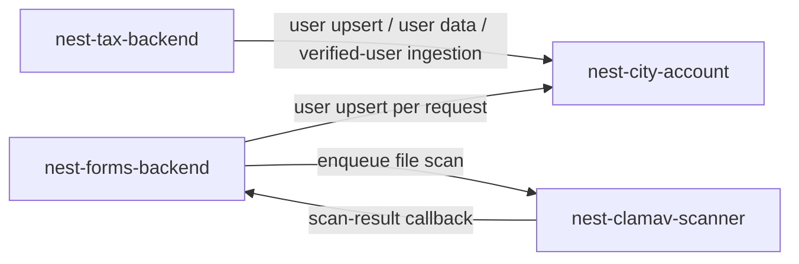
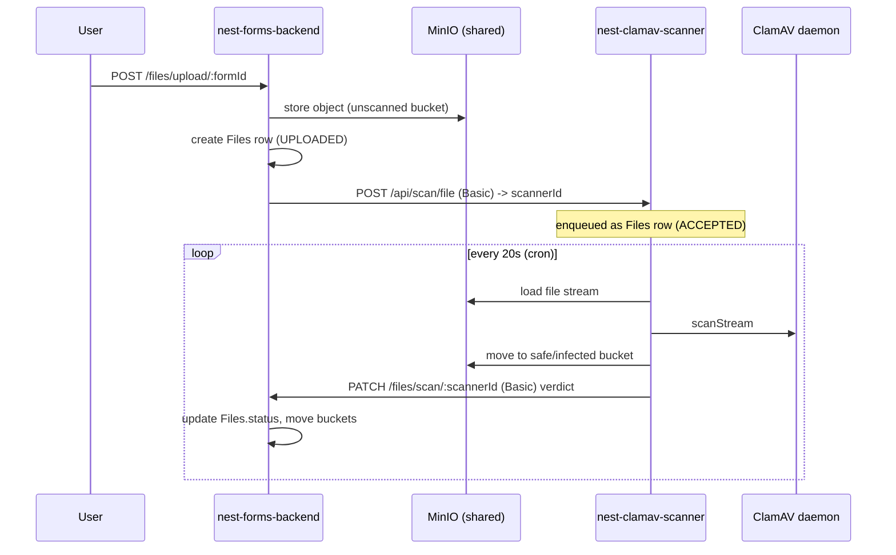
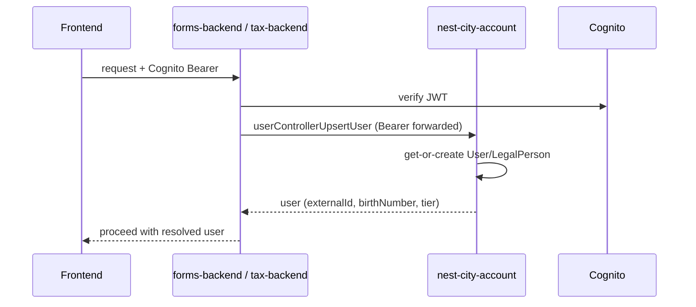
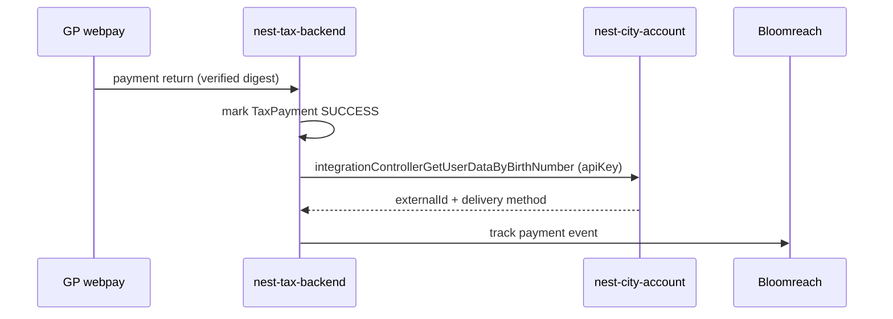
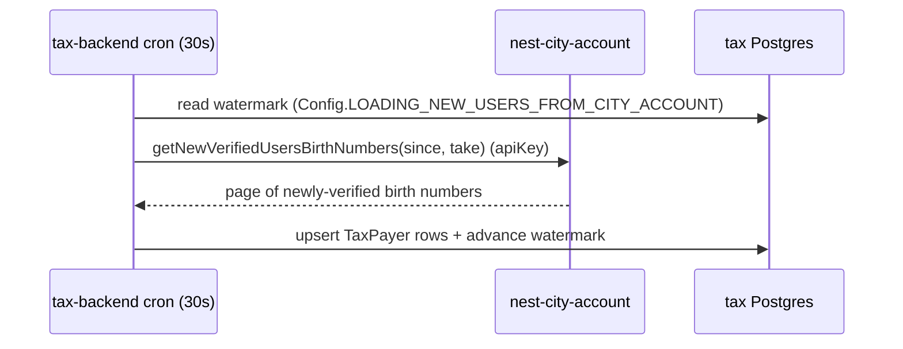

# konto.bratislava.sk -- Cross-Backend Workflows

> **Scope.** This document describes **only cross-backend workflows** -- flows where a *single request* or a *single async/scheduled job* calls across **more than one** of the konto NestJS backends. It is **not** a whole-system architecture doc.
>
> The high-level architecture of each individual service lives in that service's own `docs/ARCHITECTURE.md`:
> - [`nest-city-account/docs/ARCHITECTURE.md`](../nest-city-account/docs/ARCHITECTURE.md) -- users, accounts, verification, OAuth2, integration API
> - [`nest-forms-backend/docs/ARCHITECTURE.md`](../nest-forms-backend/docs/ARCHITECTURE.md) -- e-forms lifecycle, NASES/GINIS delivery
> - [`nest-tax-backend/docs/ARCHITECTURE.md`](../nest-tax-backend/docs/ARCHITECTURE.md) -- tax fetch/pay, Noris sync
> - [`nest-clamav-scanner/docs/ARCHITECTURE.md`](../nest-clamav-scanner/docs/ARCHITECTURE.md) -- file virus scanning
> - [`next/docs/ARCHITECTURE.md`](../next/docs/ARCHITECTURE.md) -- the web frontend (client of the backends; not itself a backend)

## Participating Backends & Edges

Only the four NestJS backends are considered here. Their **cross-backend** call graph is:

Notably, **nest-city-account is a provider only** (siblings call it; it makes no outbound calls to the trio), and **nest-clamav-scanner talks only to nest-forms-backend**. There is **no** forms↔tax and **no** tax↔clamav interaction.

Transport is HTTP in every case. Two auth styles are used between services:
- **Cognito Bearer forwarded** -- the caller passes the end user's token through (used for "resolve *this* user").
- **Service credentials** -- an admin `apiKey` header (city-account integration API) or HTTP **Basic** auth (forms ↔ clamav).

---

## Workflow 1 -- File antivirus scanning (forms ⇄ clamav)

The only fully bidirectional cross-backend workflow, and the one that spans a request *and* a scheduled job.

- **Participants:** nest-forms-backend, nest-clamav-scanner.
- **Trigger (part A -- request):** a user uploads a file to forms (`POST /files/upload/:formId`).
- **Trigger (part B -- scheduled job):** the scanner's 20-second `@Cron` worker scans queued files and calls back.
- **Transport / auth:** HTTP + HTTP Basic, both directions.
  - forms -> clamav uses raw axios (`nest-forms-backend/src/scanner-client/scanner-client.service.ts`).
  - clamav -> forms uses the shared `openapi-clients/forms` client (`nest-clamav-scanner/src/forms-client/forms-client.service.ts`).

- **Notes:** both services also poll each other's `GET /health` before acting. The scanner re-sends any terminal verdict whose `notified=false` on each cron tick (`fixUnnotifiedFiles`), so a transient forms outage self-heals. Forms rejects a form send until all attachments are `SAFE`/`INFECTED` (`areFormAttachmentsReady`).

---

## Workflow 2 -- Cognito user resolution / upsert (forms → city-account, tax → city-account)

Both forms-backend and tax-backend resolve the calling end user through city-account on **every authenticated request** -- city-account is the single source of truth for the account record behind a Cognito token.

- **Participants:** nest-forms-backend **or** nest-tax-backend -> nest-city-account.
- **Trigger (request):** any authenticated request to forms or tax.
- **Transport / auth:** HTTP via `openapi-clients/city-account`, **forwarding the end user's Cognito Bearer** to `userControllerUpsertUser`.
  - forms: `src/auth-v2/services/city-account-user.service.ts` (in `UserAuthStrategy`).
  - tax: `@BratislavaUser()` -> `UserInfoPipe` (`src/auth/decorators/user-info.decorator.ts`).

- **Notes:** city-account exposes this via its normal user API (Bearer), distinct from the admin-`apiKey` integration API used in Workflows 3-4.

---

## Workflow 3 -- Tax payment user-data enrichment (tax → city-account)

When a card payment succeeds, tax-backend needs the payer's `externalId` (for CRM/Bloomreach tracking), which it fetches from city-account's **integration API** using service credentials.

- **Participants:** nest-tax-backend -> nest-city-account.
- **Trigger (request):** GP webpay payment-return processing (`GET /payment/cardpay/response/:taxType`).
- **Transport / auth:** HTTP via `openapi-clients/city-account`, **admin `apiKey`** (`CITY_ACCOUNT_ADMIN_API_KEY`); `integrationControllerGetUserDataByBirthNumber` (retried). `nest-tax-backend/src/utils/subservices/cityaccount.subservice.ts`.

- **Notes:** the same integration API is called in **batch** (`...GetUserDataByBirthNumbersBatch`) from tax-backend's Noris import and reminder crons -- the same cross-backend edge, exercised from scheduled jobs rather than the payment request.

---

## Workflow 4 -- Newly-verified user ingestion (tax → city-account, scheduled)

tax-backend continuously ingests newly-verified City Account users so it can pre-create taxpayer records.

- **Participants:** nest-tax-backend -> nest-city-account.
- **Trigger (scheduled job):** tax-backend `@Cron(EVERY_30_SECONDS)` `loadNewUsersFromCityAccount` (`src/tasks/subservices/city-account-ingestion.tasks.service.ts`).
- **Transport / auth:** HTTP via `openapi-clients/city-account`, **admin `apiKey`**; `integrationControllerGetNewVerifiedUsersBirthNumbers` (paged with `since`/`take`).

---

## Out of Scope (deliberately not cross-backend workflows)

- **Single-service internal flows** -- e.g. the forms NASES/GINIS delivery pipeline, tax GP-webpay payment, verification against Magproxy/NASES -- documented in each service's own `docs/ARCHITECTURE.md`.
- **Calls to external (non-konto) systems** -- AWS Cognito, slovensko.sk/NASES, GINIS, Magproxy/RFO/RPO, GP webpay, Bloomreach, Mailgun/SES, Strapi, SharePoint, and the `nest-enforcement-backend` towing proxy called by city-account. These are external dependencies, not konto-to-konto workflows.
- **Shared-database coupling (not a service call):** both **nest-city-account** and **nest-tax-backend** connect **directly** to the municipal **Noris** financial system (an MSSQL database). They influence the same external data (e.g. tax delivery methods) but do **not** call each other -- so this is a shared-datastore coupling, not a cross-backend workflow.
- **The frontend (`next`)** calls all three business backends, but as a client, not as one backend orchestrating another; those are covered in the frontend's own doc.

---

> **Keep this doc in sync:** if a code change adds, removes, or changes a workflow that crosses konto backends (a new service-to-service call, a changed callback, a new cross-service cron), update this file. Changes that are internal to one service belong in that service's own `docs/ARCHITECTURE.md`.
