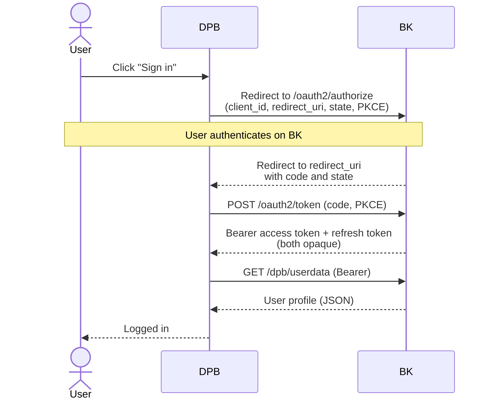

# OAuth Integration with BK

A reference for engineers integrating Dopravný podnik Bratislava (DPB) with Bratislavské konto (BK) via OAuth 2.0.

> **Version:** 1.0.0 · **Last updated:** 2026-05-29 · **Owner:** Bratislavské konto / Innovation team

## Table of Contents

- [OAuth Integration with BK](#oauth-integration-with-bk)
  - [Table of Contents](#table-of-contents)
  - [Introduction](#introduction)
  - [Overview](#overview)
    - [Identity services provided by BK](#identity-services-provided-by-bk)
  - [High-level flow](#high-level-flow)
  - [Endpoints overview](#endpoints-overview)
  - [Design principles and implementation notes](#design-principles-and-implementation-notes)
  - [Identity verification](#identity-verification)
    - [How verification works](#how-verification-works)
    - [Verification states](#verification-states)
    - [How DPB can leverage verification](#how-dpb-can-leverage-verification)
    - [Coexistence with other verification flows](#coexistence-with-other-verification-flows)
  - [Integration setup](#integration-setup)
    - [OAuth client credentials](#oauth-client-credentials)
    - [Redirect URIs](#redirect-uris)
    - [Admin API authentication (RSA)](#admin-api-authentication-rsa)
    - [Admin-initiated refresh (UPCOMING)](#admin-initiated-refresh-upcoming)
  - [UX and data-handling requirements](#ux-and-data-handling-requirements)
  - [Environments](#environments)
  - [User data exposed to DPB](#user-data-exposed-to-dpb)
    - [Default `/dpb/userdata` response](#default-dpbuserdata-response)
    - [`account_type` values](#account_type-values)
    - [Extending the payload](#extending-the-payload)
  - [Keeping user data up to date](#keeping-user-data-up-to-date)
    - [User-initiated refresh](#user-initiated-refresh)
    - [Admin-initiated refresh – UPCOMING](#admin-initiated-refresh--upcoming)
  - [Admin: login statistics](#admin-login-statistics)
  - [Best practices: DOs and DON'Ts](#best-practices-dos-and-donts)
    - [Server-side web application (confidential client) – recommended](#server-side-web-application-confidential-client--recommended)
    - [SPA / mobile (public client)](#spa--mobile-public-client)
  - [Glossary of abbreviations](#glossary-of-abbreviations)

## Introduction

This document describes the OAuth 2.0 integration between **DPB** (Dopravný podnik Bratislava) and **Bratislavské konto** (BK) – the identity service for residents of Bratislava, also referred to in English as **"City Account"**. It is intended for the engineering team on the DPB side and covers:

- what the integration provides, including the identity services BK handles on DPB's behalf;
- the high-level authentication flow and how DPB obtains user data;
- the configuration and credentials exchanged between BK and DPB to run the integration;
- the available environments and their endpoints;
- the shape of the user data BK exposes, and how data is refreshed (both by users and via admin endpoints);
- the admin endpoint for retrieving login statistics;
- recommended implementation patterns for the OAuth client on the DPB side.

## Overview

Bratislavské konto provides an identity service for the residents of Bratislava. Through the OAuth 2.0 integration, DPB gains:

- **SSO** – the user signs in once and is authenticated for DPB as well as other city services.
- **Verified users** – identities verified against the state register (national ID card or eID).
- **Login statistics** – aggregated data on who signs in via Bratislavské konto and how often.

### Identity services provided by BK

With BK acting as the sole authenticator, DPB does **not** need to handle:

- password management and password resets;
- identity verification (RFO/RPO, eID flow);
- email verification.

Any additional authentication factors or login methods that BK introduces in the future (e.g. MFA, eID login via slovensko.sk, social logins) will likewise be handled entirely on the BK side, and DPB will automatically benefit from them without implementation changes on its side.

## High-level flow

The user-facing login flow is a standard OAuth 2.0 Authorization Code flow with PKCE:

1. The user clicks "Sign in" in the DPB application.
2. DPB redirects the user's browser to the BK authorization endpoint with `client_id`, `redirect_uri`, `state`, and (for PKCE) `code_challenge` with `code_challenge_method=S256`.
3. The user authenticates on the BK side. BK handles passwords, email verification, identity verification, and any other authentication concerns.
4. BK redirects the user back to DPB's `redirect_uri` with an authorization `code` and the original `state`.
5. DPB exchanges the `code` at the BK token endpoint (`/oauth2/token`) – together with the PKCE `code_verifier` and, for confidential clients, `client_secret` – for a bearer access token and a refresh token.
6. DPB calls `GET /dpb/userdata` on the BK REST API with the bearer token to obtain the user's profile.
7. DPB establishes its own session for the user, keyed by the returned `id` (UUID).



In addition to the user-facing flow, BK exposes admin (backend-to-backend) endpoints authenticated via RSA signature – see [Admin-initiated refresh](#admin-initiated-refresh--upcoming) and [Admin: login statistics](#admin-login-statistics).

## Endpoints overview

The endpoints involved in the integration, at a glance:

| Endpoint                | Method | Authentication                                     | Purpose                                                                                       |
| ----------------------- | ------ | -------------------------------------------------- | --------------------------------------------------------------------------------------------- |
| `/oauth2/authorize`     | GET    | –                                                  | Entry point of the OAuth flow (the URL DPB redirects the user's browser to).                  |
| `/oauth2/token`         | POST   | `client_id` + `client_secret` (confidential), PKCE | Exchanges an authorization `code` for an access token; also serves the `refresh_token` grant. |
| `/dpb/userdata`         | GET    | `Authorization: Bearer <access_token>`             | Returns the authenticated user's profile.                                                     |
| `/dpb/list-user-logins` | GET    | RSA-SHA-256 signature (backend-to-backend)         | Returns aggregated login statistics for all DPB users.                                        |

Full request/response schemas, error codes, and the exact admin-signing rules (headers, signed string, replay protection) are documented in Swagger – [staging](https://nest-city-account.staging.bratislava.sk/api) · [prod](https://nest-city-account.bratislava.sk/api).

## Design principles and implementation notes

- The integration follows the standard OAuth 2.0 specification:
  - [RFC 6749 – The OAuth 2.0 Authorization Framework](https://datatracker.ietf.org/doc/html/rfc6749)
  - [RFC 7636 – PKCE for OAuth Public Clients](https://datatracker.ietf.org/doc/html/rfc7636)
  - [RFC 9700 – Best Current Practice for OAuth 2.0 Security](https://datatracker.ietf.org/doc/html/rfc9700)
- Because the integration is spec-compliant, DPB is free to use any OAuth library that conforms to the OAuth specification – it will work out of the box.
- Once it holds a bearer token, DPB calls the BK REST API to obtain user data: <https://nest-city-account.bratislava.sk/api#/DPB/DpbController_userData>.
- **The bearer access token is opaque – it is _not_ a JWT.** Do not attempt to decode or inspect it; treat it as a random string and use it solely as the `Authorization: Bearer …` credential when calling BK endpoints. All user information must be retrieved by calling `/dpb/userdata` (or other documented endpoints), never by parsing the token itself.
- **Refresh tokens are supported.** Every successful token response also includes a refresh token alongside the access token, and the token endpoint accepts both `authorization_code` and `refresh_token` grant types – so DPB can extend a session beyond the access-token TTL without forcing the user to re-authenticate. Whether to actually use refresh tokens is up to DPB; if used, the usual OAuth 2.0 hygiene needs to be applied (store on the backend only, rotate, revoke on logout, etc.).
- The implementation contract remains stable across future changes: _bearer token → call REST endpoint → receive JSON as documented in Swagger_. New fields will simply be added to the `userdata` endpoint, or exposed via a separate endpoint.
- **BK is the sole authenticator.** If the available login options are extended in the future (for example via the slovensko.sk portal or via Google), this will be handled exclusively on the BK side. Nothing changes for DPB: DPB will still redirect users to BK for authentication, BK will handle the rest, and will send the authenticated user back without any changes to the process on the DPB side.

## Identity verification

BK integrates with Slovak state registries to verify a user's real-world identity. Verification is performed entirely on the BK side; DPB does not need to implement any verification flow itself, but can read the result, drive users into verification, or require it as a precondition of login.

### How verification works

BK offers two verification methods. Which method is available depends on the user's `account_type` – a user sees only the flow that applies to their account:

| `account_type`                           | Available method                                              |
| ---------------------------------------- | ------------------------------------------------------------- |
| `fo` (natural person)                    | National ID card / residence document checked against the RFO |
| `po`, `fo-p` (legal entity, sole trader) | eID via slovensko.sk (UPVS)                                   |

**National ID card / residence document (RFO) – currently `fo` accounts only.** The user submits their document number and birth number (RČ); BK matches first name, last name, RČ, and document number against the **RFO** (Register fyzických osôb – the Slovak register of natural persons). The currently accepted document types are:

- _Občiansky preukaz_ (Slovak national ID card)
- _Povolenie na pobyt_ (residence permit)
- _Pobytový preukaz občana EÚ_ (EU citizen residence card)
- _Cestovný pas_ (passport)

The user does **not** have to be a Slovak national – it is sufficient to hold a valid Slovak-issued document of one of the types above. Foreign residents with a Slovak residence permit, an EU residence card, or a Slovak-issued passport are equally supported.

**eID via slovensko.sk (UPVS) – currently `po` and `fo-p` accounts only.** The user authenticates with their electronic ID through the UPVS portal; the verified identity is propagated to BK.

### Verification states

BK tracks each account's verification state. The current state can be exposed to DPB on request as an additional field in the `/dpb/userdata` response (see [Extending the payload](#extending-the-payload)).

| State                        | Meaning                                                              |
| ---------------------------- | -------------------------------------------------------------------- |
| `NEW`                        | Account exists, but the user has not started any verification.       |
| `QUEUE_IDENTITY_CARD`        | ID-card data submitted; verification against the RFO is in progress. |
| `NOT_VERIFIED_IDENTITY_CARD` | ID-card verification against the RFO failed (data did not match).    |
| `IDENTITY_CARD`              | Verified via the RFO path (national ID card / residence document).   |
| `EID`                        | Verified via the eID path (slovensko.sk / UPVS).                     |

`IDENTITY_CARD` and `EID` are the two terminal "verified" states; the others indicate that the user is not (yet) verified. These states are not dependent on the account type.

### How DPB can leverage verification

There are three ways to make use of BK verification, from least to most invasive on the user experience:

1. **Read the verification state passively.** Once the verification field is enabled on `userdata`, DPB simply inspects it on each login (or on each call to `/dpb/userdata`) and decides whether to grant verified-only functionality. No change to the OAuth flow.
2. **Redirect users to the BK verification page on demand.** At any point, DPB can link the user out to <https://konto.bratislava.sk/overenie-identity>. After the user completes the flow there, the next call to `/dpb/userdata` reflects the new state.
3. **Require verification at login (`identity:verified` scope).** Include `scope=identity:verified` in the authorization request and BK will require the user to complete verification before redirecting back to the provided `redirect_uri`. The scope must be allow-listed for the client on the BK side. It is not enabled for the DPB client by default; should a use case for this verification enforcement be identified in the future, it can be configured on request.

### Coexistence with other verification flows

BK identity verification is independent of any verification process DPB may run on its own, and the two can coexist. If a user is already verified through BK at the moment DPB needs an identity check, the verification state is available via the mechanisms above, and DPB can decide on a case-by-case basis whether any further in-house check is still needed for that user.

## Integration setup

The integration depends on a fixed set of credentials and configuration on both sides. Each environment (dev, staging, prod) has its own values; nothing is shared across environments.

### OAuth client credentials

BK issues a `client_id` and `client_secret` per environment. DPB uses them when calling `/oauth2/token`. Credentials can be re-sent on request; `client_secret` rotation is done in cooperation when either side identifies a need.

### Redirect URIs

DPB registers at least one `redirect_uri` per environment with BK.

BK enforces **exact match** against the list of URIs registered for that environment – wildcards and partial matches are not supported. Each URI must be registered in its full, final form.

### Admin API authentication (RSA)

DPB generates one RSA SHA-256 key pair per environment and registers the public key with BK. BK uses it to verify backend-to-backend admin requests (e.g. `/dpb/list-user-logins`). The private key remains on the DPB side and is never shared externally.

The key pair can be generated as follows:

```bash
openssl genrsa -out private_key.pem 2048
openssl rsa -in private_key.pem -pubout -out public_key.pem
# register public_key.pem with BK; keep private_key.pem on the DPB side
```

### Admin-initiated refresh (UPCOMING)

Branch-based data refresh (see [Admin-initiated refresh – UPCOMING](#admin-initiated-refresh--upcoming)) is not part of the current implementation. Enabling it requires agreement on both sides: endpoint paths, request/response shape, and how each party operates its side of the flow. Implementation on the BK side is expected to be short once those details have been agreed.

## UX and data-handling requirements

These guidelines protect users from confusion and security issues, and keep DPB-displayed data consistent with BK. They are derived from the fact that BK is the single source of truth for identity and personal data.

- **Inform the user about the redirect.** The redirect to login should be accompanied by a clear notice explaining the redirection, so the user is not confused when they suddenly find themselves on the BK page.

- **Never ask the user for BK credentials.** Authentication takes place exclusively on the BK side; the OAuth client (PAAS, DPB) must under no circumstances ask the user for their login credentials.

- **Do not pretend to manage BK identity data.** The OAuth client must not give the impression that it can change login information or personal data on the BK side. For changes to personal data, redirect the user directly to the BK profile.

- **Always read personal data fresh from BK.** Whenever personal data (or any other data managed by BK) is displayed, it must be loaded from BK and not served from a local cache – stale caches can prevent updates from being visible or cause data to drift out of sync. Fields such as email, first name, and last name may be stored locally for internal purposes (e.g. joins, audit logs), but whenever they are displayed in the profile or used after a user action, they must be fetched fresh from BK.

## Environments

Bratislavské konto provides three independent environments: **dev**, **staging**, and **prod**.

Each environment has its own `client_id` / `client_secret`. Tokens are not transferable between environments, and user accounts are isolated per environment (for example, it is not possible to sign in to staging using a production account).

> **Note on `dev`.** The `dev` environment is reserved for exceptional cases where active development and prototyping are in progress on both sides – it allows fast, reactive changes without affecting the other environments. Do not use it routinely without explicit guidance from BK. Normal development happens locally; new changes and features are first deployed to **staging**, where – after testing – they are released to **prod**.

|             | staging                                           | prod                                      |
| ----------- | ------------------------------------------------- | ----------------------------------------- |
| **BE**      | <https://nest-city-account.staging.bratislava.sk> | <https://nest-city-account.bratislava.sk> |
| **FE**      | <https://city-account-next.staging.bratislava.sk> | <https://konto.bratislava.sk>             |
| **Purpose** | Integration testing with DPB                      | Live production                           |

## User data exposed to DPB

### Default `/dpb/userdata` response

Swagger: [staging](https://nest-city-account.staging.bratislava.sk/api#/DPB/DpbController_userData) · [prod](https://nest-city-account.bratislava.sk/api#/DPB/DpbController_userData)

```json
{
  "id": "9e7791b2-787b-4b93-8473-94a70a516025",
  "email": "user@example.com",
  "email_verified": "true",
  "account_type": "fo",
  "name": "Company s.r.o.",
  "given_name": "Jožko",
  "family_name": "Bratislavský"
}
```

Field notes:

- `id` – UUID; the **only** stable, unambiguous identifier of a user. Use this as a primary key when persisting users on the DPB side.
- `name` – returned only for `po` and `fo-p` accounts.
- `given_name` and `family_name` – returned only for `fo` accounts.

### `account_type` values

| Value  | Meaning                                           |
| ------ | ------------------------------------------------- |
| `fo`   | Natural person (_fyzická osoba_)                  |
| `po`   | Legal entity (_právnická osoba_)                  |
| `fo-p` | Self-employed natural person / sole trader (SZČO) |

### Extending the payload

If needed, by mutual agreement and with the appropriate legal coverage, the list of provided fields can be extended – for example with date of birth (or age), identity verification status, IČO, and so on.

## Keeping user data up to date

### User-initiated refresh

Data managed by BK can be updated by the user in their BK profile at <https://konto.bratislava.sk/moj-profil>. First name, last name, email, and password can all be changed there.

Changes made in BK are **not** automatically pushed to DPB. However, the next call to <https://nest-city-account.bratislava.sk/api#/DPB/DpbController_userData> will return the updated data. DPB should therefore **not** store any of this data for anything other than informational/internal purposes – when displaying the profile in DPB, always request fresh data from BK via the `userData` endpoint.

In practice, this means:

- If a user signed in to DPB in the past but currently only uses BK, DPB will only see the updated information after the user's next login to DPB.
- Even when the email changes, the `id` stays the same for the same user. Always treat `id` as the source of identity.
- After an email change, a new BK account can be registered on the original email. Consequently, it is possible for a new user (with a new `id`) to end up holding the same email that another (different `id`) BK account had in the past.

### Admin-initiated refresh – UPCOMING

In some cases, user data needs to be updated outside of the online flow – not in the user's BK profile, but in person at a DPB branch where the citizen physically presents a request to change their data. (Online changes should still be made by the user themselves in BK.)

The first identified scenario is updating the name on a transit card after a citizen's name change (e.g. after marriage). Because many citizens have their account verified against the **RFO** (register of natural persons), it is not appropriate to change the name in the profile directly – instead, BK should refresh the data from the RFO.

The endpoint for this scenario (**TBD**) will, for a given citizen's account (identified by login email), accept a birth number (RČ) and an ID-card number, provided the DPB employee has verified the validity of the ID card and that the photo matches the citizen. The data will then be automatically updated on the BK side and pushed to DPB via a DPB-side endpoint (**TBD**).

If the citizen is unable to present a valid Slovak identity document, they should be referred to change their data directly in their BK profile (and then accessing DPB), or to contact BK support.

## Admin: login statistics

Swagger: [staging](https://nest-city-account.staging.bratislava.sk/api#/DPB/DpbController_listUserLogins) · [prod](https://nest-city-account.bratislava.sk/api#/DPB/DpbController_listUserLogins)

Returns a list of all user logins with statistics. **Authenticated via RSA signature (backend-to-backend).** For each user `id` BK provides:

- the number of times the user logged in via OAuth 2.0 for DPB (`loginCount`);
- the first time they logged in to DPB (`firstLogin`);
- the most recent time they logged in to DPB (`latestLogin`).

The result is returned as a list with one object per user:

```json
[
  {
    "loginCount": 5,
    "firstLogin": "2024-01-15T10:30:00.000Z",
    "latestLogin": "2024-02-20T14:45:00.000Z",
    "id": "123e4567-e89b-12d3-a456-426614174000"
  }
]
```

## Best practices: DOs and DON'Ts

Implementation recommendations for the DPB side. Choose the section that matches the DPB client type.

### Server-side web application (confidential client) – recommended

- **DO** use `client_secret` (mandatory) together with PKCE (very strongly recommended, `code_challenge_method=S256`).
- **DO** perform the token exchange (`POST /oauth2/token`) from the DPB backend – **never** from the browser.
- **DO** store tokens in `HttpOnly` `Secure` cookies or a server-side session. **DO NOT** store them in `localStorage`.
- **DO** send a `state` parameter on every authorization request, and verify it on the callback (recommended).

### SPA / mobile (public client)

- **DO NOT** use `client_secret` – a public client cannot keep it secret.
- **DO** use PKCE; it is mandatory (`code_challenge_method=S256`).
- **DO** generate a `code_verifier` as a random string of 43–128 characters from `[A-Za-z0-9\-._~]`.
- **DO** always send a `state` parameter on the authorization request, and verify it on the callback.
- **DO** store tokens in secure platform storage (iOS Keychain / Android Keystore).

## Glossary of abbreviations

Quick reference for the abbreviations and short forms used in this document, in alphabetical order.

| Abbreviation | Stands for                          | Notes                                                                                                                                      |
| ------------ | ----------------------------------- | ------------------------------------------------------------------------------------------------------------------------------------------ |
| **API**      | Application Programming Interface   | Here specifically the BK REST API.                                                                                                         |
| **BE**       | Backend                             | Server-side component of an environment.                                                                                                   |
| **BK**       | Bratislavské konto ("City Account") | The identity service for residents of Bratislava; the OAuth Authorization Server in this integration.                                      |
| **DPB**      | Dopravný podnik Bratislava          | Bratislava's public-transport operator; the OAuth client in this integration.                                                              |
| **eID**      | Electronic identity document        | Slovak electronic ID card used for online identity verification.                                                                           |
| **FE**       | Frontend                            | Browser-facing component of an environment.                                                                                                |
| **IČO**      | _Identifikačné číslo organizácie_   | Slovak organization identification number (company ID).                                                                                    |
| **JSON**     | JavaScript Object Notation          | Wire format used by the REST API.                                                                                                          |
| **JWT**      | JSON Web Token                      | Signed/encoded token format. Mentioned only to clarify that BK access tokens are **not** JWTs.                                             |
| **MFA**      | Multi-Factor Authentication         | Additional authentication factors on top of a password. Not currently provided by BK; once added, will be handled entirely on the BK side. |
| **OAuth**    | Open Authorization                  | Industry-standard authorization protocol; this integration uses OAuth 2.0.                                                                 |
| **PAAS**     | PAAS mobile parking application     | Another OAuth client integrated with BK; used in this document as an additional example alongside DPB.                                     |
| **PKCE**     | Proof Key for Code Exchange         | OAuth 2.0 extension that protects the authorization code (see RFC 7636).                                                                   |
| **PROD**     | Production                          | The live production environment.                                                                                                           |
| **RČ**       | _Rodné číslo_                       | Slovak birth number / personal identification number.                                                                                      |
| **REST**     | Representational State Transfer     | Architectural style of the BK API.                                                                                                         |
| **RFC**      | Request for Comments                | IETF specification document (e.g. RFC 6749 defines OAuth 2.0).                                                                             |
| **RFO**      | _Register fyzických osôb_           | Slovak state register of natural persons.                                                                                                  |
| **RPO**      | _Register právnických osôb_         | Slovak state register of legal entities.                                                                                                   |
| **RSA**      | Rivest–Shamir–Adleman               | Public-key cryptosystem used for backend-to-backend admin request signatures.                                                              |
| **SHA-256**  | Secure Hash Algorithm, 256-bit      | Cryptographic hash function paired with RSA for signing admin requests.                                                                    |
| **SPA**      | Single-Page Application             | Browser-side application that talks directly to APIs; a public OAuth client.                                                               |
| **SSO**      | Single Sign-On                      | One login session unlocks access to multiple services.                                                                                     |
| **SZČO**     | _Samostatne zárobkovo činná osoba_  | Self-employed person / sole trader. Maps to the `fo-p` `account_type`.                                                                     |
| **TBD**      | To Be Determined                    | Marker for details that are not yet finalized.                                                                                             |
| **UPVS**     | _Ústredný portál verejnej správy_   | Central portal for Slovak public-administration services (slovensko.sk); used for eID-based identity verification.                         |
| **UUID**     | Universally Unique Identifier       | 128-bit identifier; the format of the user `id` field returned by `/dpb/userdata`.                                                         |
