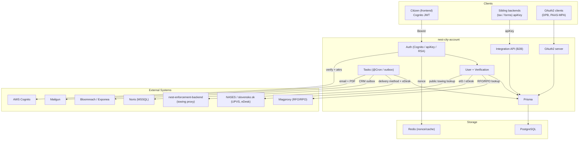
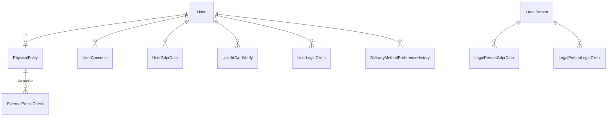

# nest-city-account -- Architecture

> This is the high-level architecture for the **nest-city-account** service, one app in the `konto.bratislava.sk` monorepo. For workflows that span multiple konto backends, see the repo-root [`docs/ARCHITECTURE.md`](../../docs/ARCHITECTURE.md).

## System Overview

`nest-city-account` is the backend that owns the **user / account domain** for Bratislava City Account (Konto). It manages user and legal-person records, account verification (identity card, eID/UPVS, IČO/RPO), GDPR consents, tax-document delivery-method preferences, and acts as an **OAuth2 identity provider** for client apps (DPB, PAAS-MPA). It also exposes a stable B2B **integration API** consumed by sibling konto backends.

The backend is a **NestJS** application backed by **PostgreSQL** (Prisma), with **Redis** (nonce/cache), a transactional **Bloomreach outbox**, and a direct **MSSQL** connection to the municipal **Noris** financial system. Users authenticate with **AWS Cognito**; service callers use an admin **apiKey**; some clients use **RSA request signing**.

### Environments

| Environment | URL |
|---|---|
| Production | `https://nest-city-account.bratislava.sk/` |
| Staging | `https://nest-city-account.staging.bratislava.sk/` |
| Development | `https://nest-city-account.dev.bratislava.sk/` |
| Local | `http://localhost:3000/` |

Config is validated/typed via decorator classes (`src/config/environment-variables.ts`, `BaConfigService`). `CLUSTER_ENV` is `dev`/`staging`/`production`.

---

## High-Level Architecture

---

## Module Map

Root `src/app.module.ts` wires config, Prisma, the feature modules, and `ScheduleModule.forRoot()`; `AppLoggerMiddleware` runs on all routes except `oauth2/*`; `AppController` exposes `GET /healthcheck`.

| Module | Prefix | Auth | Purpose |
|---|---|---|---|
| **AuthModule** | `/auth` | -- | Passport strategies/guards (Cognito, admin apiKey, RSA signature) + nonce service |
| **UserModule** | `/user`, `/user-integration` | Cognito / apiKey | User CRUD, consents, delivery-method preference, Bloomreach sync; B2B contact/ID lookup |
| **VerificationModule** | `/user-verification` | Cognito | Identity-card, IČO-RPO, eID verification |
| **IntegrationModule** | `/integration` | apiKey | **Stable B2B API for sibling backends** (see Cross-Backend) |
| **OAuth2Module** | `/oauth2` | OAuth2 guards | Authorization-code server for client apps |
| **DpbModule / PaasMpaModule** | `/dpb`, `/paas-mpa` | OAuth2 / RSA | Client integrations (DPB user logins/data; PAAS-MPA registration) |
| **TowingModule** | `/towing` | public (Turnstile) | Public towing lookup proxy to the enforcement backend |
| **AdminModule** | `/admin` | apiKey | Maintenance ops + cron |
| **NorisModule** | -- | -- | Noris (MSSQL) delivery-method + eDesk sync |
| **TasksModule** | -- | -- | Cron orchestration + Bloomreach outbox processor |
| Supporting | -- | -- | Magproxy, NASES, Bloomreach, Mailgun, PDF-generator, Cache (Redis), PhysicalEntity, UPVS queue |

---

## Data Model Overview

### Models (`prisma/schema.prisma`)

- **User** -- core account. `externalId` (Cognito sub), `email`, `ifo`, `birthNumber` (unique), `cognitoTier`, tax delivery fields, deceased flags, verification counters.
- **LegalPerson** -- legal/self-employed account (`ico`, unique `[ico, birthNumber]`) with parallel consent/GDPR/login-client relations.
- **PhysicalEntity** -- consolidated magproxy/NASES data; `uri` (UPVS/eDesk URI), eDesk activity + update metadata. Optional 1:1 to `User`.
- **UserConsents / *History**, **UserGdprData** -- consents + append-only audit.
- **UserIdCardVerify** -- short-lived encrypted verification data.
- **ExternalEdeskCheck** -- UPVS eDesk-check queue keyed on `norisId`.
- **OAuth2Data** -- authorization codes + encrypted tokens (PKCE).
- **BloomreachOutbox** -- transactional outbox for CRM commands.
- **UserLoginClient / LegalPersonLoginClient**, **Config**, **DeliveryMethodPreferenceHistory**.

Enums include `CognitoUserAttributesTierEnum` (NEW, QUEUE/NOT_VERIFIED/IDENTITY_CARD, EID), `DeliveryMethodEnum`, `ConsentEnum`, `GDPRCategoryEnum`, `LoginClientEnum` (DPB, PAAS_MPA, CITY_ACCOUNT).

---

## Authentication & Authorization

Three Passport strategies:

1. **Cognito JWT** -- validates RS256 access tokens via JWKS; loads the user via `CognitoSubservice`. Protects `/user/*` and `/user-verification/*`.
2. **Admin apiKey** -- `HeaderAPIKeyStrategy` (header `apiKey`, timing-safe compare to `ADMIN_APP_SECRET`). Protects `/admin/*`, `/integration/*`, `/user-integration/*` -- the B2B surface.
3. **RSA signature** -- `@SignatureAuth()` verifies `X-Signature` (RSA-SHA256 over `METHOD|PATH|TIMESTAMP|BODY`) with a 5-min window and optional Redis-backed nonce replay protection. Used by DPB.

**OAuth2 server** endpoints use their own request guards (`HttpsGuard`, `AuthorizationRequestGuard`, `TokenRequestGuard`, `OAuth2AccessGuard`). **Public**: `GET /healthcheck` and `POST /towing/public/:ecv` (Cloudflare Turnstile captcha).

Auth schemes: `apiKey` (header) + Bearer (Cognito).

---

## External Integrations

| Integration | Purpose | Files / env |
|---|---|---|
| **AWS Cognito** | Identity provider; user attribute/tier management. | `src/auth/strategies/cognito.strategy.ts`; `AWS_COGNITO_*`. |
| **Magproxy** | RFO/RPO registry lookups (natural + legal persons) via Azure-AD-authenticated OpenAPI client. | `src/magproxy/*`, `openapi-clients/magproxy`; `MAGPROXY_*`. |
| **NASES / slovensko.sk (UPVS, eDesk)** | eID identity checks, eDesk status. | `src/nases/*`, `openapi-clients/slovensko-sk`; `SLOVENSKO_SK_*`. |
| **Noris (MSSQL)** | Push delivery methods + eDesk status to the municipal financial system (direct DB). | `src/noris/*`; `MSSQL_*`. |
| **Bloomreach / Exponea** | CRM via transactional outbox; separate contacts Postgres. | `src/bloomreach/*`; `BLOOMREACH_*`. |
| **Mailgun** | Delivery-method change emails with PDF attachments. | `src/mailgun/*`; `MAILGUN_*`. |
| **PDF generator (Playwright)** | Render tax-delivery PDFs. | `src/pdf-generator/*`. |
| **nest-enforcement-backend** | Public towing lookup proxy. | `src/towing/towing.service.ts`; `ENFORCEMENT_BACKEND_*`. |
| **Redis** | Nonce replay store / cache. | `src/cache/*`; `REDIS_*`. |

---

## Cross-Backend Calls

Within konto, city-account is the **provider of record** -- siblings call *it*, not the other way around.

- **Inbound (siblings -> city-account):** the Admin-apiKey **Integration API** (`/integration`): `GET /integration/userdata`, `POST /integration/userdata-batch`, `POST /integration/get-verified-users-birth-numbers-batch`; plus `GET /user-integration/contact-and-id-info/:externalId`. **nest-tax-backend** consumes these to resolve taxpayers, batch user data, and ingest newly verified users.
- **Outbound to konto siblings:** none to forms/tax/clamav (a historical tax-backend upload was removed). The only outbound service proxy is to **nest-enforcement-backend** (towing) -- a Bratislava backend, but not one of the konto trio.
- **Noris caveat:** city-account reads/writes Noris (MSSQL) directly -- a shared-database integration with the tax domain, not a service-to-service call.

---

## Request Lifecycle

Global setup (`src/main.ts`): custom logger, global `ValidationPipe`, global filters `ErrorFilter` -> `TypeErrorFilter` -> `HttpExceptionFilter`. `AppLoggerMiddleware` logs method/URL/status/timing (except OAuth2 routes, which add `NoCacheMiddleware` + a scoped OAuth2 filter). `ThrowerErrorGuard` is the standard typed-exception factory.

Representative trace -- **`POST /user-verification/identity-card`**: logger middleware -> `ValidationPipe` -> `CognitoGuard` (verify JWT, load user) -> `VerificationService` -> Magproxy (RFO lookup, Azure-AD auth) and/or NASES -> persist encrypted `UserIdCardVerify` and update the user's `cognitoTier`.

---

## Async Messaging & Scheduled Jobs

- **Bloomreach outbox** -- a transactional (DB-backed) outbox processed on an interval rather than through a broker queue.
- **Cron** (`@nestjs/schedule`, `src/tasks/tasks.service.ts`) -- Bloomreach outbox processing, delivery-method + eDesk sync to Noris, OAuth2 code cleanup, yearly delivery-method lock, daily summary emails.
- **Redis** backs the nonce/replay store; RabbitMQ is provisioned.

## API Documentation

Swagger UI is served at `/api`.

## Deployment

The app is containerised and deployed to **Kubernetes** across three environments -- **development**, **staging**, and **production** -- automated through **GitHub Actions**. Infrastructure code lives in [bratislava/infrastructure-deployment-configuration](https://github.com/bratislava/infrastructure-deployment-configuration).

---

> **Keep this doc in sync:** if a code change updates something described here (modules, data model, auth, integrations, the integration API, crons, deployment), update this `ARCHITECTURE.md` in the same change.
