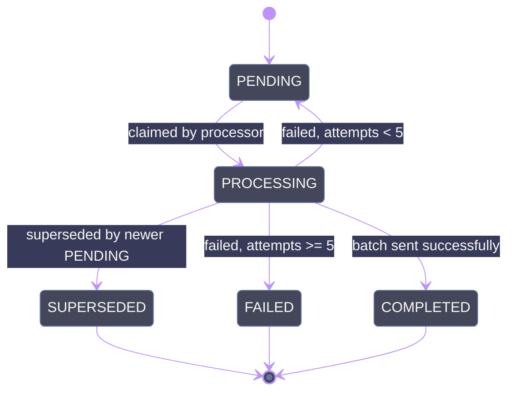

# Bloomreach Module

Handles synchronization of customer data and consent events with [Bloomreach](https://www.bloomreach.com/) via a **transactional outbox pattern**.

## Architecture

Instead of calling the Bloomreach API synchronously during request handling, all commands are written to a `BloomreachOutbox` database table and processed asynchronously in batches.

### Why the outbox pattern?

- **Decouples** request handling from Bloomreach availability - callers never fail due to Bloomreach being down.
- **Automatic retries** - failed batches are retried with exponential backoff up to `MAX_ATTEMPTS` (5) before being marked `FAILED`.
- **Batching** - multiple commands are sent in a single Bloomreach batch API call, reducing HTTP overhead.
- **Single-writer** - `@Interval(30_000)` waits for the previous run to complete before scheduling the next, so batches never overlap.

## Key Components

| File | Responsibility |
|------|---------------|
| `bloomreach-outbox.service.ts` | Public API - `trackCustomer()`, `trackEventConsents()`, `anonymizeCustomer()`. Writes outbox entries to DB, deduplicating customer upserts at write time. |
| `bloomreach-outbox.processor.ts` | Claims a batch (up to 50), sends to Bloomreach batch API. Scheduled every 30s by `TasksService`. |
| `bloomreach-payload.builder.ts` | Builds Bloomreach command payloads (`customers`, `customers/events`). Fetches user data from Cognito and DB. |
| `bloomreach-contact-database.service.ts` | Manages contact records in a separate Bloomreach contact database (upsert, phone). |
| `bloomreach.types.ts` | Command types, enums, and batch API type definitions. |

## Outbox Entry Lifecycle

## Write-Time Deduplication

Customer commands are deduplicated when written to the outbox:

- **Customer upserts** (`customers` command): if a PENDING entry already exists for the same `cognitoId`, its `commandData` is updated in place (via a transaction) instead of creating a duplicate row.
- **Event commands** (`customers/events`): deduplicated by `cognitoId` + `event_type` + `category` - if a PENDING entry with the same combination exists, its `commandData` is updated in place; otherwise a new row is created.

This ensures the outbox contains at most one PENDING `customers` entry per user at any time, so the processor doesn't need to merge at read time.

**Per-property merge:** When a PENDING `customers` entry already exists, the new `commandData` is shallow-merged into the existing one (`{ ...existing.customer_ids, ...new.customer_ids }` and likewise for `properties`). This preserves any fields the latest call didn't touch while still applying updates.

## Processing Order

The processor claims entries in **global `createdAt` order** - oldest first, up to `BATCH_SIZE` (50) per cycle. There is no per-key grouping or ordering constraint in the claim query itself.

This is safe because write-time deduplication already prevents duplicate PENDING entries for the same key (see above), so in practice there is at most one PENDING entry per key at any time. Since `@Interval` waits for the previous run to complete, batches never overlap, and `recoverStaleProcessingEntries` resets any entries stuck from a crash before each cycle.

## Revert-Time Deduplication

When a batch fails (HTTP error or per-command `success=false`), entries are reverted to PENDING for retry. Before reverting, the processor checks whether a **newer PENDING entry** was written for the same dedup key while the old entry was PROCESSING (write-time dedup only checks PENDING entries, so it would have created a new row instead of merging).

If a newer entry exists:

- **`customers` commands**: the old entry's `commandData` is **merged into** the newer entry (`{ ...old, ...newer }`, newer takes precedence), mirroring the write-time merge that was skipped. The old entry is marked `SUPERSEDED` with `lastError: "Superseded by newer PENDING entry"`.
- **`customers/events` commands**: the old entry is simply marked `SUPERSEDED` - the newer entry fully replaces it (no merge needed).

The `SUPERSEDED` status is distinct from `FAILED` because the data may still be delivered through the newer entry — it indicates a partial failure that was absorbed, not a permanent loss.

The same logic applies during crash recovery (`recoverStaleProcessingEntries`).