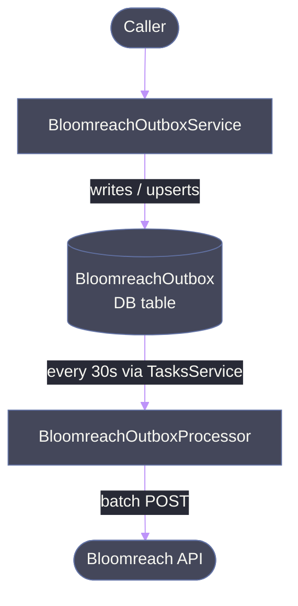
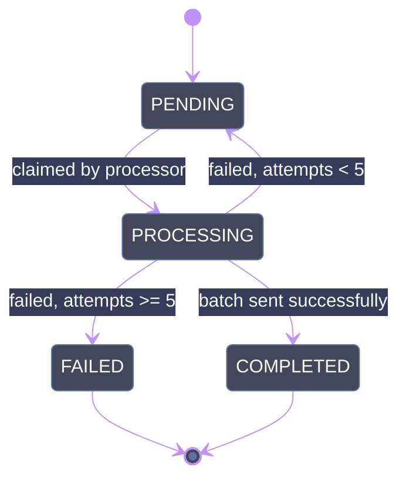

# Bloomreach Module

Handles synchronization of customer data and consent events with [Bloomreach](https://www.bloomreach.com/) via a **transactional outbox pattern**.

## Architecture

Instead of calling the Bloomreach API synchronously during request handling, all commands are written to a `BloomreachOutbox` database table and processed asynchronously in batches.

### Why the outbox pattern?

- **Decouples** request handling from Bloomreach availability — callers never fail due to Bloomreach being down.
- **Automatic retries** — failed batches are retried with exponential backoff up to `MAX_ATTEMPTS` (5) before being marked `FAILED`.
- **Batching** — multiple commands are sent in a single Bloomreach batch API call, reducing HTTP overhead.
- **Concurrency-safe** — uses `FOR UPDATE SKIP LOCKED` so multiple instances don't process the same entries.

## Key Components

| File | Responsibility |
|------|---------------|
| `bloomreach-outbox.service.ts` | Public API — `trackCustomer()`, `trackEventConsents()`, `anonymizeCustomer()`. Writes outbox entries to DB, deduplicating customer upserts at write time. |
| `bloomreach-outbox.processor.ts` | Claims a batch (up to 50), sends to Bloomreach batch API. Scheduled every 30s by `TasksService`. |
| `bloomreach-payload.builder.ts` | Builds Bloomreach command payloads (`customers`, `customers/events`). Fetches user data from Cognito and DB. |
| `bloomreach-contact-database.service.ts` | Manages contact records in a separate Bloomreach contact database (upsert, phone). |
| `bloomreach.types.ts` | Command types, enums, and batch API type definitions. |

## Outbox Entry Lifecycle

## Write-Time Deduplication

Customer commands are deduplicated when written to the outbox:

- **Customer upserts** (`customers` command): if a PENDING entry already exists for the same `cognitoId`, its `commandData` is updated in place (via a transaction) instead of creating a duplicate row.
- **Event commands** (`customers/events`): always inserted as new rows — each event is distinct.

This ensures the outbox contains at most one PENDING `customers` entry per user at any time, so the processor doesn't need to merge at read time.

**Why "keep latest" and not per-property merge:** Each `customers` command is a full snapshot of the user's current state (fetched from Cognito + DB at queue time), not a partial patch. The latest snapshot always has the most up-to-date values.