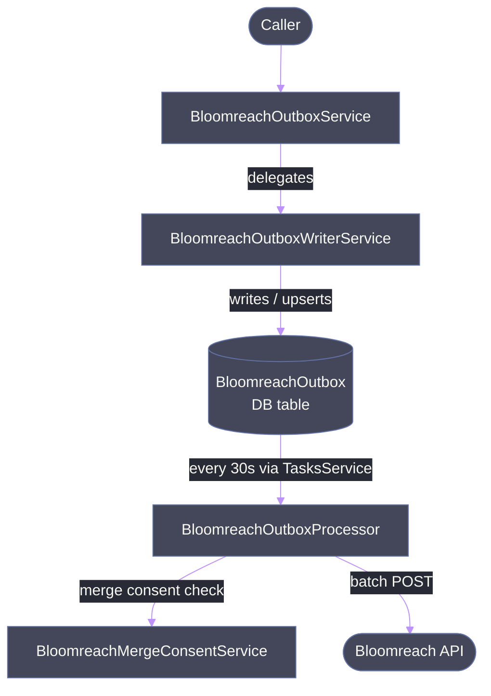
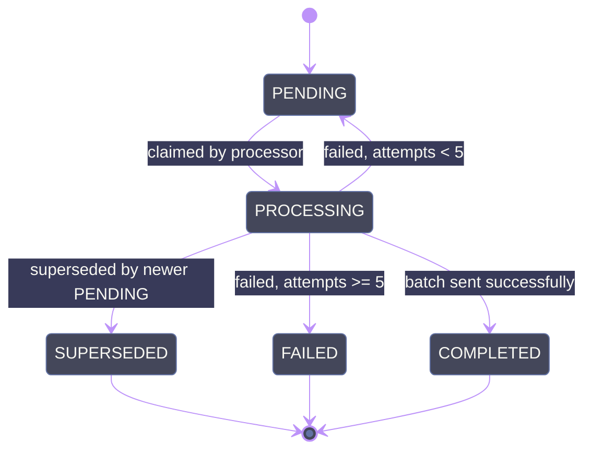

# Bloomreach Module

Handles synchronization of customer data and consent events with [Bloomreach](https://www.bloomreach.com/) via a
**transactional outbox pattern**.

## Architecture

Instead of calling the Bloomreach API synchronously during request handling, all commands are written to a
`BloomreachOutbox` database table and processed asynchronously in batches.

```mermaid
%%{init: {'theme': 'base', 'themeVariables': {'primaryColor': '#44475a', 'primaryTextColor': '#f8f8f2', 'primaryBorderColor': '#6272a4', 'lineColor': '#bd93f9', 'secondaryColor': '#383a59', 'tertiaryColor': '#282a36', 'background': '#282a36', 'mainBkg': '#44475a', 'nodeBorder': '#6272a4', 'clusterBkg': '#383a59', 'titleColor': '#f8f8f2', 'edgeLabelBackground': '#282a36'}}}%%
flowchart TD
    A([Caller]) --> B[BloomreachOutboxService]
    B -->|delegates| W[BloomreachOutboxWriterService]
    W -->|writes / upserts| C[(BloomreachOutbox\nDB table)]
    C -->|every 30s via TasksService| D[BloomreachOutboxProcessor]
    D -->|merge consent check| M[BloomreachMergeConsentService]
    D -->|batch POST| E([Bloomreach API])
```

### Why the outbox pattern?

- **Decouples** request handling from Bloomreach availability. Callers never fail due to Bloomreach being down.
- **Automatic retries**. Failed batches are retried with exponential backoff up to `MAX_ATTEMPTS` (5) before being
  marked `FAILED`. A failed merge consent check (see below) doesn't count toward this budget - it isn't Bloomreach
  rejecting the command, so it retries indefinitely instead of ever being marked `FAILED`.
- **Batching** - multiple commands are sent in a single Bloomreach batch API call, reducing HTTP overhead.
- **Single-writer** - `@Interval(30_000)` does *not* wait for the previous run to finish, so `processOutbox` wraps
  `processBatch` in a `pg_try_advisory_lock`-based single-flight guard (`runWithAdvisoryLock`) instead - a shared
  DB-level lock, so it also holds if this ever runs on more than one instance, unlike an in-memory flag.

## Key Components

| File                                  | Responsibility                                                                                                                                                                 |
|---------------------------------------|--------------------------------------------------------------------------------------------------------------------------------------------------------------------------------|
| `bloomreach-outbox.service.ts`        | Public queueing API - `trackCustomer()`, `trackConsents()`, `anonymizeCustomer()`. Thin wrapper: skips when the integration is inactive and logs failures instead of throwing. |
| `bloomreach-outbox-writer.service.ts` | Builds commands and writes them to the outbox, deduplicating at write time. Module-internal (not exported), throws on failure.                                                 |
| `bloomreach-outbox.processor.ts`      | Claims a batch (up to 50), runs the merge consent check, sends to Bloomreach batch API. Scheduled every 30s by `TasksService`.                                                 |
| `bloomreach-payload.builder.ts`       | Builds Bloomreach command payloads (`customers`, `customers/events`). Fetches user data from Cognito and DB.                                                                   |
| `bloomreach-export.service.ts`        | Read access to Bloomreach - fetches a customer (`export-one`) and its consent events. Requires "GDPR > Export customer" and "Events > Get" API key permissions.                |
| `bloomreach-merge-consent.service.ts` | Protects consents when a customer is about to merge with an anonymized Bloomreach profile (see below).                                                                         |
| `contact-database/`                   | Submodule managing contact records in a separate Bloomreach contact database (upsert, phone). Exports the service; the pg provider stays private.                              |
| `bloomreach.types.ts`                 | Command types, enums, batch and export API type definitions.                                                                                                                   |

## Outbox Entry Lifecycle

```mermaid
%%{init: {'theme': 'base', 'themeVariables': {'primaryColor': '#44475a', 'primaryTextColor': '#f8f8f2', 'primaryBorderColor': '#6272a4', 'lineColor': '#bd93f9', 'secondaryColor': '#383a59', 'tertiaryColor': '#282a36', 'background': '#282a36', 'mainBkg': '#44475a', 'nodeBorder': '#6272a4', 'labelBackgroundColor': '#282a36'}}}%%
stateDiagram-v2
    [*] --> PENDING
    PENDING --> PROCESSING:claimed by processor
    PROCESSING --> COMPLETED:batch sent successfully
    PROCESSING --> PENDING:failed, attempts < 5
    PROCESSING --> FAILED:failed, attempts >= 5
    PROCESSING --> SUPERSEDED:superseded by newer PENDING
    SUPERSEDED --> [*]
    FAILED --> [*]
    COMPLETED --> [*]
```

## Write-Time Deduplication

`BloomreachOutboxWriterService` deduplicates commands when writing to the outbox, holding a `pg_advisory_xact_lock` per
dedup key (`lockTransactionWithKey`) for the duration of the check-and-write so concurrent callers can't race past each
other:

- **Customer upserts** (`customers` command): if a PENDING entry already exists for the same `externalId`, its
  `commandData` is updated in place instead of creating a duplicate row.
- **Event commands** (`customers/events`): deduplicated by `externalId` + `event_type` + `category`. If a PENDING entry
  with the same combination exists and the incoming command doesn't outrank it (see Terminal Entries below), its
  `commandData` is updated in place; otherwise a new row is created.

This ensures the outbox contains at most one PENDING `customers` entry per user at any time, so the processor doesn't
need to merge at read time. Two partial unique indexes enforce the same invariant at the DB level as a backstop. The
advisory lock is what actually keeps them from ever being hit.

**Per-property merge:** When a PENDING `customers` entry already exists, the new `commandData` is shallow-merged into
the existing one (`{ ...existing.customer_ids, ...new.customer_ids }` and likewise for `properties`). This preserves any
fields the latest call didn't touch while still applying updates.

## Terminal Entries

The anonymize `customers` command and the marketing/general consent-reject events queued alongside it
(`anonymizeCustomer`) are **terminal**: they represent the account's final Bloomreach state, so a weaker write must
never reorder or silently disappear behind them.

- A `customers` command is terminal iff `properties.is_identity_verified === false`. A `customers/events` command is
  terminal only when queued by `anonymizeCustomer`.
- **At write time**, `isExistingHigherPriorityEventCommand` lets an existing terminal event outrank an incoming
  non-terminal one regardless of timestamp; between two entries of the same terminal-ness, the newer timestamp wins.
  Customer commands don't need this check - `mergeCustomerCommandData` already keeps whichever side is terminal.
- **DB triggers back this up** for cases the write-time, PENDING-only check can't see: an `UPDATE` can never flip
  `isTerminal` from true to false (`ERRCODE BR001`, surfaced as `isTerminalDowngradeError` - should never happen, always
  thrown/alerted), and an `INSERT` is rejected outright if a non-`FAILED` terminal entry already exists for the same
  dedup key – unconditionally, not just one that's at least as recent (`ERRCODE BR003`, surfaced as
  `isTerminalOverrideError` and logged instead of thrown when queuing events). The `FAILED` exception matters: if the
  terminal entry itself exhausts retries and lands on `FAILED`, it no longer blocks a later insert for the same key – a
  genuinely undelivered anonymize doesn't get to permanently lock the key out.
- Two more triggers enforce the PENDING-dedup invariant itself with named codes rather than the app interpreting a bare
  unique-constraint violation: `ERRCODE BR004` (`isDuplicatePendingCustomerError`) and `ERRCODE BR005`
  (`isDuplicatePendingEventError`), both meaning `lockTransactionWithKey` should have prevented the conflict and
  didn't - always alerted. `ERRCODE BR002` marks an unrecognized `BloomreachCommandName` reaching a trigger that doesn't
  know how to handle it yet.
- Once an entry becomes terminal, a trigger deletes every other entry sharing its dedup key. A terminal entry is meant
  to be the sole, final word for that key.

## Explicit Timestamps

Bloomreach does **not** execute commands within a batch in the order they appear. Every command therefore carries an
explicit timestamp set when it is queued:

- `customers` commands: `update_timestamp` - Bloomreach resolves property conflicts (e.g., during a customer merge) by
  this timestamp. When commands are merged in the outbox, the newer entry's timestamp is kept.
- `customers/events` commands: `timestamp` - Bloomreach evaluates consents by the latest consent event timestamp.

Without these, ordering would depend on batch delivery timing (entries can sit in the outbox through retries and
backoff), making consent and property resolution nondeterministic.

`anonymizeCustomer` stamps its anonymize `customers` command and the paired MARKETING/GENERAL reject events with **one
shared timestamp**, computed once and passed to both. The merge consent check (below) treats the anonymize command's own
`update_timestamp` as standing in for exactly when the rejects took effect too - that only holds if they're genuinely
the same value, not two independent `now()` calls a few milliseconds apart.

## Merge Consent Check

When a `customers` command delivers a `contact_id` for the first time, Bloomreach merges the customer with any existing
profile carrying that `contact_id`. If that profile belongs to a previously **anonymized** account (same person,
deactivated, re-registered, and re-verified), its explicitly rejected consents could win the merge's latest-wins
resolution and silently revoke the fresh consents.

Before sending such a command, `BloomreachMergeConsentService` runs these steps. An entry continues to the next step
only if the current one doesn't disqualify it from causing a harmful merge:

1. **Does this command even need checking?** A command that itself de-verifies the account
   (`is_identity_verified: false`) never restores its own consents. It's an anonymization, not a merge to protect
   against. And a command without a `contact_id` can't cause a merge at all. Stop for either.
2. **Could this be a first attachment?** A COMPLETED `customers` entry already carrying the same (`externalId`,
   `contact_id`) pair means the attachment was delivered before and no new merge can be triggered, stop. A heuristic
   judged purely from our outbox: only a pair's first attachment pays for the steps below.
3. **Is a separate anonymize command racing for this same account?** If this entry was already claimed by the processor
   before a fresh `anonymizeCustomer` call for the same `externalId` was queued, the write-time PENDING-only merge can't
   fold the two together. The anonymize lands as its own row instead of being absorbed into this one. If a live or
   recently-completed anonymize exists for this externalId, stop - restoring consents here would fight the account's own
   anonymization.
4. **Is there a profile to merge with?** Fetch the profile holding the `contact_id` from Bloomreach (`export-one`). No
   profile, or a profile already carrying this `city_account_id`, means we can stop.
5. **Is that profile anonymized?** Either the exported profile shows `is_identity_verified: false`, or (only checked
   when the export doesn't already confirm it) our outbox holds a live/recently-completed anonymize command for one of
   the candidate `city_account_id`s that Bloomreach may not have applied yet. Candidates are the profile's
   already-linked ids, plus any other account whose own outbox rows are separately trying to attach this same
   `contact_id` (its merge into the profile may already be in flight, just not reflected in this export yet).
   Anonymizations queued **after** this customer command don't count since those are deliberate revocations that must win
   the merge. If neither, stop.
6. **Re-assert consents.** A merge with an anonymized profile is imminent: read the customer's consent events back from
   Bloomreach (source of truth) and merge in this account's own locally live/recently-completed
   consent events too, since the export can lag a genuine, not-yet-delivered change by up to
   `BLOOMREACH_PROPAGATION_WINDOW_HOURS`. Reduce both sources together to the latest state per ESBS category.
7. **Anchor the restore's timestamp.** Bloomreach resolves consents by latest timestamp regardless of delivery order, so
   each restored consent must land strictly after the anonymization it's protecting against and not at its own honest
   original timestamp (which may predate the anonymization), and not at an unbounded `now()` either (which
   could wrongly outrank a genuinely newer, unrelated consent change made well after the merge). The anchor is the
   anonymize command's own `update_timestamp` when a local entry for it was found in step 5 (exact, since it's shared
   with its reject events – see Explicit Timestamps above), or `now()` as a conservative fallback when only the export
   confirmed anonymization. No exact local moment to read. Each consent's timestamp is raised to `anchor + 10s` only if
   it otherwise loses to the reject - never lowered if it's already safely newer.

## Processing Order

The processor claims entries in **global `createdAt` order** - oldest first, up to `BATCH_SIZE` (50) per cycle. There is
no per-key grouping or ordering constraint in the claim query itself.

This is safe because write-time deduplication already prevents duplicate PENDING entries for the same key (see above),
so in practice there is at most one PENDING entry per key at any time. The `runWithAdvisoryLock` guard (see above)
ensures batches never overlap, and `recoverStaleProcessingEntries` resets any entries stuck from a crash before each
cycle.

## Revert-Time Deduplication

When a batch fails (HTTP error or per-command `success=false`), entries are reverted to PENDING for retry. Before
reverting, the processor checks whether a **newer PENDING entry** was written for the same dedup key while the old entry
was PROCESSING. Write-time dedup only checks PENDING entries, so it would have created a new row instead of merging.
This check runs under the same per-dedup-key advisory lock as write-time deduplication, so it can't race with a
concurrent write.

If a newer entry exists:

- **`customers` commands**: the old entry's `commandData` is **merged into** the newer entry (`{ ...old, ...newer }`,
  newer takes precedence), mirroring the write-time merge that was skipped, and `isTerminal` is recomputed from the
  merge result. The old entry is marked `SUPERSEDED` with
  `lastError: "Superseded by newer PENDING entry <superseding-entry-id>"`.
- **`customers/events` commands**: normally the old entry is simply marked `SUPERSEDED` - the newer entry fully replaces
  it (no merge needed). Exception: if the old entry is terminal and the newer one isn't, the terminal reject must still
  win, so the old entry's `commandData` overwrites the newer entry's instead (which inherits `isTerminal: true`).

The `SUPERSEDED` status is distinct from `FAILED` because the data may still be delivered through the newer entry — it
indicates a partial failure that was absorbed, not a permanent loss.

The same logic applies during crash recovery (`recoverStaleProcessingEntries`).