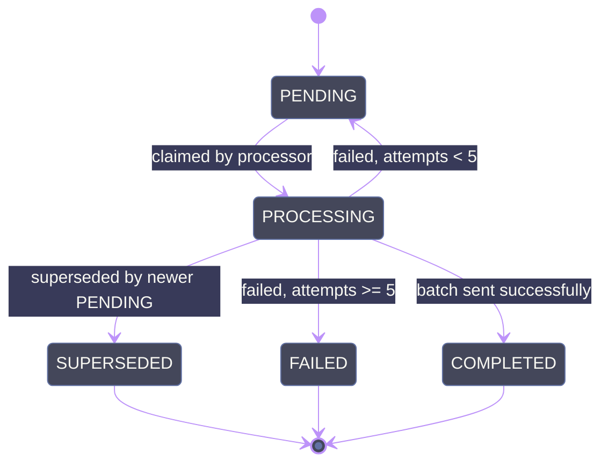

# Bloomreach Module

Handles synchronization of customer data and consent events with [Bloomreach](https://www.bloomreach.com/) via a **transactional outbox pattern**.

## Architecture

Instead of calling the Bloomreach API synchronously during request handling, all commands are written to a `BloomreachOutbox` database table and processed asynchronously in batches.

```mermaid
%%{init: {'theme': 'base', 'themeVariables': {'primaryColor': '#44475a', 'primaryTextColor': '#f8f8f2', 'primaryBorderColor': '#6272a4', 'lineColor': '#bd93f9', 'secondaryColor': '#383a59', 'tertiaryColor': '#282a36', 'background': '#282a36', 'mainBkg': '#44475a', 'nodeBorder': '#6272a4', 'clusterBkg': '#383a59', 'titleColor': '#f8f8f2', 'edgeLabelBackground': '#282a36'}}}%%
flowchart TD
    A([Caller]) --> B[BloomreachOutboxService]
    B -->|delegates| W[BloomreachOutboxWriterService]
    W -->|writes / upserts| C[(BloomreachOutbox\nDB table)]
    C -->|every 30s via TasksService| D[BloomreachOutboxProcessor]
    D -->|merge consent check| M[BloomreachMergeConsentService]
    D -->|batch POST| E([Bloomreach API])
```

### Why the outbox pattern?

- **Decouples** request handling from Bloomreach availability - callers never fail due to Bloomreach being down.
- **Automatic retries** - failed batches are retried with exponential backoff up to `MAX_ATTEMPTS` (5) before being marked `FAILED`.
- **Batching** - multiple commands are sent in a single Bloomreach batch API call, reducing HTTP overhead.
- **Single-writer** - `@Interval(30_000)` waits for the previous run to complete before scheduling the next, so batches never overlap.

## Key Components

| File | Responsibility |
|------|---------------|
| `bloomreach-outbox.service.ts` | Public queueing API - `trackCustomer()`, `trackConsents()`, `anonymizeCustomer()`. Thin wrapper: skips when the integration is inactive and logs failures instead of throwing. |
| `bloomreach-outbox-writer.service.ts` | Builds commands and writes them to the outbox, deduplicating at write time. Module-internal (not exported), throws on failure. |
| `bloomreach-outbox.processor.ts` | Claims a batch (up to 50), runs the merge consent check, sends to Bloomreach batch API. Scheduled every 30s by `TasksService`. |
| `bloomreach-payload.builder.ts` | Builds Bloomreach command payloads (`customers`, `customers/events`). Fetches user data from Cognito and DB. |
| `bloomreach-export.service.ts` | Read access to Bloomreach - fetches a customer (`export-one`) and its consent events. Requires "GDPR > Export customer" and "Events > Get" API key permissions. |
| `bloomreach-merge-consent.service.ts` | Protects consents when a customer is about to merge with an anonymized Bloomreach profile (see below). |
| `contact-database/` | Submodule managing contact records in a separate Bloomreach contact database (upsert, phone). Exports the service; the pg provider stays private. |
| `bloomreach.types.ts` | Command types, enums, batch and export API type definitions. |

## Outbox Entry Lifecycle

```mermaid
%%{init: {'theme': 'base', 'themeVariables': {'primaryColor': '#44475a', 'primaryTextColor': '#f8f8f2', 'primaryBorderColor': '#6272a4', 'lineColor': '#bd93f9', 'secondaryColor': '#383a59', 'tertiaryColor': '#282a36', 'background': '#282a36', 'mainBkg': '#44475a', 'nodeBorder': '#6272a4', 'labelBackgroundColor': '#282a36'}}}%%
stateDiagram-v2
    [*] --> PENDING
    PENDING --> PROCESSING: claimed by processor
    PROCESSING --> COMPLETED: batch sent successfully
    PROCESSING --> PENDING: failed, attempts < 5
    PROCESSING --> FAILED: failed, attempts >= 5
    PROCESSING --> SUPERSEDED: superseded by newer PENDING
    SUPERSEDED --> [*]
    FAILED --> [*]
    COMPLETED --> [*]
```

## Write-Time Deduplication

Customer commands are deduplicated when written to the outbox:

- **Customer upserts** (`customers` command): if a PENDING entry already exists for the same `externalId`, its `commandData` is updated in place (via a transaction) instead of creating a duplicate row.
- **Event commands** (`customers/events`): deduplicated by `externalId` + `event_type` + `category` - if a PENDING entry with the same combination exists, its `commandData` is updated in place; otherwise a new row is created.

This ensures the outbox contains at most one PENDING `customers` entry per user at any time, so the processor doesn't need to merge at read time.

**Per-property merge:** When a PENDING `customers` entry already exists, the new `commandData` is shallow-merged into the existing one (`{ ...existing.customer_ids, ...new.customer_ids }` and likewise for `properties`). This preserves any fields the latest call didn't touch while still applying updates.

## Explicit Timestamps

Bloomreach does **not** execute commands within a batch in the order they appear. Every command therefore carries an explicit timestamp set when it is queued:

- `customers` commands: `update_timestamp` - Bloomreach resolves property conflicts (e.g. during a customer merge) by this timestamp. When commands are merged in the outbox, the newer entry's timestamp is kept.
- `customers/events` commands: `timestamp` - Bloomreach evaluates consents by the latest consent event timestamp.

Without these, ordering would depend on batch delivery timing (entries can sit in the outbox through retries and backoff), making consent and property resolution nondeterministic.

## Merge Consent Check

When a `customers` command delivers a `contact_id` for the first time, Bloomreach merges the customer with any existing profile carrying that `contact_id`. If that profile belongs to a previously **anonymized** account (same person, deactivated, re-registered and re-verified), its explicitly rejected consents win the merge's latest-wins resolution and silently revoke the fresh consents.

Before sending such a command, `BloomreachMergeConsentService` runs these steps. An entry continues to the next step only if the current one doesn't disqualify it from causing a harmful merge:

1. **Could this be a first attachment?** A COMPLETED `customers` entry already carrying the same (`externalId`, `contact_id`) pair means the attachment was delivered before - no new merge can be triggered, stop. A heuristic judged purely from our outbox, Only first attachments in outbox table pay for the steps below.
2. **Is there a profile to merge with?** Fetch the profile holding the `contact_id` from Bloomreach (`export-one`). No profile, or a profile already carrying this `city_account_id` means we can stop.
3. **Is that profile anonymized?** Either the exported profile shows `is_identity_verified: false`, or our outbox holds an anonymize for the person that Bloomreach may not have applied yet. Anonymizations queued **after** the customer command don't count - those are deliberate revocations that must win the merge. If not anonymized then stop.
4. **Re-assert consents.** A merge with an anonymized profile is imminent: read the customer's consent events back from Bloomreach (source of truth - never from our DB), reduce them to the latest state per ESBS category, and queue them as new consent events. Their timestamps are newer than the anonymization rejects, so they win the merge resolution regardless of delivery order.

## Processing Order

The processor claims entries in **global `createdAt` order** - oldest first, up to `BATCH_SIZE` (50) per cycle. There is no per-key grouping or ordering constraint in the claim query itself.

This is safe because write-time deduplication already prevents duplicate PENDING entries for the same key (see above), so in practice there is at most one PENDING entry per key at any time. Since `@Interval` waits for the previous run to complete, batches never overlap, and `recoverStaleProcessingEntries` resets any entries stuck from a crash before each cycle.

## Revert-Time Deduplication

When a batch fails (HTTP error or per-command `success=false`), entries are reverted to PENDING for retry. Before reverting, the processor checks whether a **newer PENDING entry** was written for the same dedup key while the old entry was PROCESSING (write-time dedup only checks PENDING entries, so it would have created a new row instead of merging).

If a newer entry exists:

- **`customers` commands**: the old entry's `commandData` is **merged into** the newer entry (`{ ...old, ...newer }`, newer takes precedence), mirroring the write-time merge that was skipped. The old entry is marked `SUPERSEDED` with `lastError: "Superseded by newer PENDING entry <superseding-entry-id>"`.
- **`customers/events` commands**: the old entry is simply marked `SUPERSEDED` - the newer entry fully replaces it (no merge needed).

The `SUPERSEDED` status is distinct from `FAILED` because the data may still be delivered through the newer entry — it indicates a partial failure that was absorbed, not a permanent loss.

The same logic applies during crash recovery (`recoverStaleProcessingEntries`).