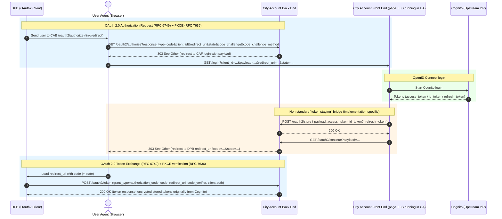

```mermaid
sequenceDiagram
    autonumber
    participant DPB as DPB (OAuth2 Client)
    actor UA as User Agent (Browser)
    participant CAB as City Account Back End
    participant CAF as City Account Front End (page + JS running in UA)
    participant COG as Cognito (Upstream IdP)

    rect rgb(230,245,255)
        Note over DPB, CAB: OAuth 2.0 Authorization Request (RFC 6749) + PKCE (RFC 7636)
        DPB ->> UA: Send user to CAB /oauth2/authorize (link/redirect)
        UA ->> CAB: GET /oauth2/authorize?response_type=code&client_id&redirect_uri&state&code_challenge&code_challenge_method
        CAB -->> UA: 303 See Other (redirect to CAF login with payload)
        UA ->> CAF: GET /login?client_id=...&payload=...&redirect_uri=...&state=...
    end

    rect rgb(235,255,235)
        Note over CAF, COG: OpenID Connect login
        CAF ->> COG: Start Cognito login
        COG -->> CAF: Tokens (access_token / id_token / refresh_token)
    end

    rect rgb(255,245,230)
        Note over CAF, CAB: Non-standard "token staging" bridge (implementation-specific)
        CAF ->> CAB: POST /oauth2/store { payload, access_token, id_token?, refresh_token }
        CAB -->> CAF: 200 OK
        CAF ->> CAB: GET /oauth2/continue?payload=...
        CAB -->> UA: 303 See Other (redirect to DPB redirect_uri?code=...&state=...)
    end

    rect rgb(230,245,255)
        Note over DPB, CAB: OAuth 2.0 Token Exchange (RFC 6749) + PKCE verification (RFC 7636)
        UA ->> DPB: Load redirect_uri with code (+ state)
        DPB ->> CAB: POST /oauth2/token (grant_type=authorization_code, code, redirect_uri, code_verifier, client auth)
        CAB -->> DPB: 200 OK (token response: encrypted stored tokens originally from Cognito)
    end
```
