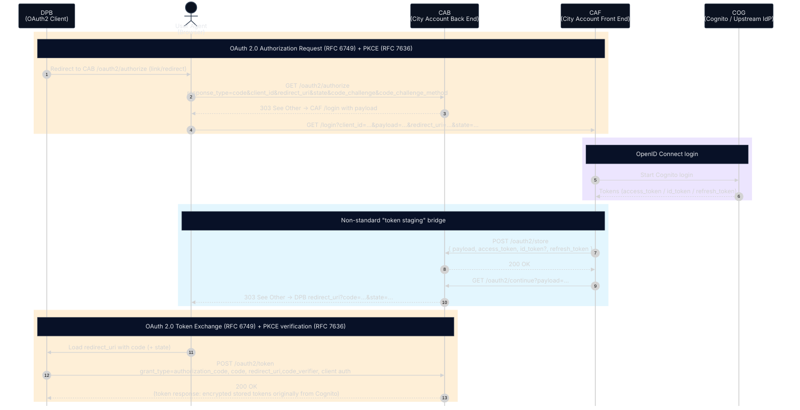

```mermaid
---
config:
  theme: 'dark'
  sequence:
    mirrorActors: false
    noteMargin: 15
    boxTextMargin: 5
  themeVariables:
    fontFamily: "Inter, Segoe UI, Roboto, Arial"
    noteBkgColor: "#081127"
    noteTextColor: "#E5E7EB"
    noteBorderColor: "#374151"
    # Actor styling
    actorBkg: "#0B1220"
    actorBorder: "#334155"
    actorTextColor: "#E5E7EB"
    # Lines/text
    lineColor: "#94A3B8"
    textColor: "#E5E7EB"
---
sequenceDiagram
    autonumber
    participant DPB as DPB<br/>(OAuth2 Client)
    actor UA as User Agent<br/>(Browser)
    participant CAB as CAB<br/>(City Account Back End)
    participant CAF as CAF<br/>(City Account Front End)
    participant COG as COG<br/>(Cognito / Upstream IdP)

    rect rgba(245, 158, 11, 0.16)
        Note over DPB, CAF: OAuth 2.0 Authorization Request (RFC 6749) + PKCE (RFC 7636)
        DPB ->> UA: Redirect to CAB /oauth2/authorize (link/redirect)
        UA ->> CAB: GET /oauth2/authorize<br/>response_type=code&client_id&redirect_uri&state&code_challenge&code_challenge_method
        CAB -->> UA: 303 See Other → CAF /login with payload
        UA ->> CAF: GET /login?client_id=…&payload=…&redirect_uri=…&state=…
    end

    rect rgba(139, 92, 246, 0.16)
        Note over CAF, COG: OpenID Connect login
        CAF ->> COG: Start Cognito login
        COG -->> CAF: Tokens (access_token / id_token / refresh_token)
    end

    rect rgba(56, 189, 248, 0.14)
        Note over UA, CAF: Non-standard "token staging" bridge
        CAF ->> CAB: POST /oauth2/store<br/>{ payload, access_token, id_token?, refresh_token }
        CAB -->> CAF: 200 OK
        CAF ->> CAB: GET /oauth2/continue?payload=…
        CAB -->> UA: 303 See Other → DPB redirect_uri?code=…&state=…
    end

    rect rgba(245, 158, 11, 0.16)
        Note over DPB, CAB: OAuth 2.0 Token Exchange (RFC 6749) + PKCE verification (RFC 7636)
        UA ->> DPB: Load redirect_uri with code (+ state)
        DPB ->> CAB: POST /oauth2/token<br/>grant_type=authorization_code, code, redirect_uri,code_verifier, client auth
        CAB -->> DPB: 200 OK<br/>(token response: encrypted stored tokens originally from Cognito)
    end
```
