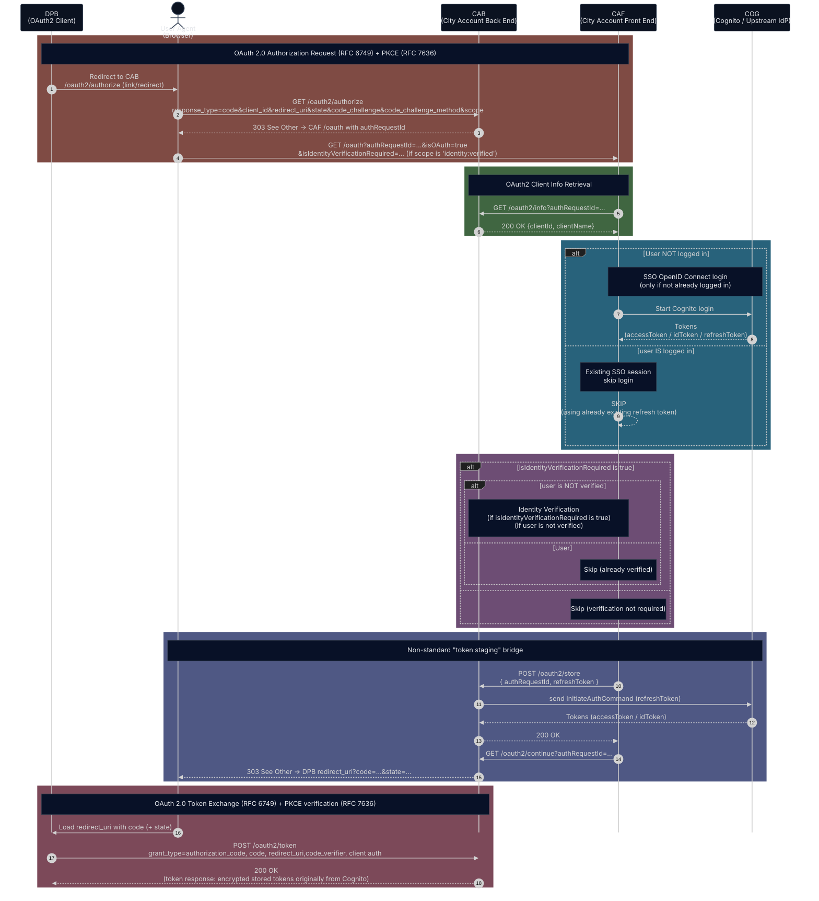

```mermaid
---
config:
  theme: 'dark'
  sequence:
    mirrorActors: false
    noteMargin: 15
    boxTextMargin: 5
  themeVariables:
    fontFamily: "Inter, Segoe UI, Roboto, Arial"
    noteBkgColor: "#081127"
    noteTextColor: "#E5E7EB"
    noteBorderColor: "#374151"
    # Actor styling
    actorBkg: "#0B1220"
    actorBorder: "#334155"
    actorTextColor: "#E5E7EB"
    # Lines/text
    lineColor: "#94A3B8"
    textColor: "#E5E7EB"
---
sequenceDiagram
    autonumber
    participant DPB as DPB<br/>(OAuth2 Client)
    actor UA as User Agent<br/>(Browser)
    participant CAB as CAB<br/>(City Account Back End)
    participant CAF as CAF<br/>(City Account Front End)
    participant COG as COG<br/>(Cognito / Upstream IdP)

    rect rgba(127, 75, 68)
        Note over DPB, CAF: OAuth 2.0 Authorization Request (RFC 6749) + PKCE (RFC 7636)
        DPB ->> UA: Redirect to CAB<br>/oauth2/authorize (link/redirect)
        UA ->> CAB: GET /oauth2/authorize<br/>response_type=code&client_id&redirect_uri&state&code_challenge&code_challenge_method&scope
        CAB -->> UA: 303 See Other → CAF /oauth with authRequestId
        UA ->> CAF: GET /oauth?authRequestId=…&isOAuth=true<br>&isIdentityVerificationRequired=… (if scope is 'identity:verified')
    end

    rect rgba(64, 102, 65)
        Note over CAB, CAF: OAuth2 Client Info Retrieval
        CAF ->> CAB: GET /oauth2/info?authRequestId=…
        CAB -->> CAF: 200 OK {clientId, clientName}
    end

    rect rgba(40, 98, 123)
        alt User NOT logged in
            Note over CAF, COG: SSO OpenID Connect login<br>(only if not already logged in)
            CAF ->> COG: Start Cognito login
            COG -->> CAF: Tokens<br>(accessToken / idToken / refreshToken)
        else user IS logged in
            Note over CAF: Existing SSO session<br>skip login
            CAF -->> CAF: SKIP<br>(using already existing refresh token)
        end
    end

    rect rgba(109, 77, 116)
        alt isIdentityVerificationRequired is true
            alt user is NOT verified
                Note over CAB, CAF: Identity Verification<br/>(if isIdentityVerificationRequired is true)<br/>(if user is not verified)
            else User
                Note over CAF: Skip (already verified)
            end
        else
            Note over CAF: Skip (verification not required)
        end
    end

    rect rgba(79, 88, 132)
        Note over UA, COG: Non-standard "token staging" bridge
        CAF ->> CAB: POST /oauth2/store<br/>{ authRequestId, refreshToken }
        CAB ->> COG: send InitiateAuthCommand (refreshToken)
        COG -->> CAB: Tokens (accessToken / idToken)
        CAB -->> CAF: 200 OK
        CAF ->> CAB: GET /oauth2/continue?authRequestId=…
        CAB -->> UA: 303 See Other → DPB redirect_uri?code=…&state=…
    end

    rect rgba(124, 73, 89)
        Note over DPB, CAB: OAuth 2.0 Token Exchange (RFC 6749) + PKCE verification (RFC 7636)
        UA ->> DPB: Load redirect_uri with code (+ state)
        DPB ->> CAB: POST /oauth2/token<br/>grant_type=authorization_code, code, redirect_uri,code_verifier, client auth
        CAB -->> DPB: 200 OK<br/>(token response: encrypted stored tokens originally from Cognito)
    end
```
