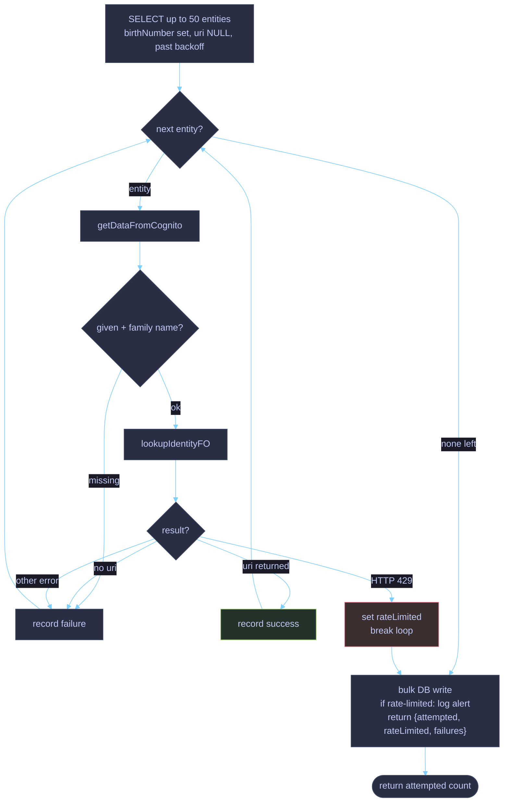
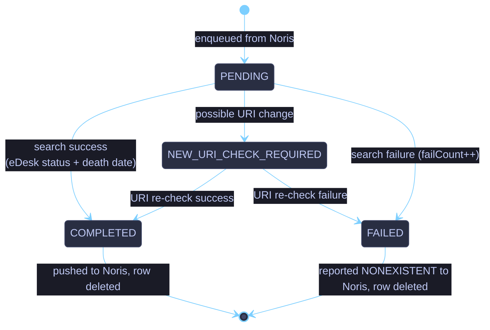
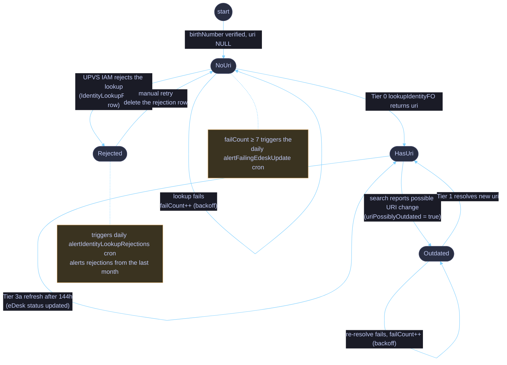

# UPVS multi-tier priority work scheduler

`UpvsQueueService` resolves and refreshes **UPVS identities** (URI + eDesk status) for two
populations:

- **Internal** users - `PhysicalEntity` rows linked to a `User`.
- **External** records - `ExternalEdeskCheck` rows fed from the **Noris** tax backend.

> [!IMPORTANT]
> There is no single FIFO queue. Every 30 seconds `processBatch()` selects work from several **prioritised tiers**, each backed by a different selector and a different UPVS endpoint, under a shared per-tick budget.

## Code map

| File                                                               | Role                                                       |
|:-------------------------------------------------------------------|:-----------------------------------------------------------|
| [`upvs-queue.service.ts`](./upvs-queue.service.ts)                 | Facade + `processBatch()` orchestration, public queue API  |
| [`urgent-lookup.service.ts`](./urgent-lookup.service.ts)           | Tier 0 - per-person identity lookup with rate-limit cutout |
| [`edesk-uri-update.service.ts`](./edesk-uri-update.service.ts)     | Tiers 1-2 - single-item URI repair (internal + external)   |
| [`edesk-batch-search.service.ts`](./edesk-batch-search.service.ts) | Tier 3 - batched URI search, success/failure persistence   |
| [`upvs-queue.queries.ts`](./upvs-queue.queries.ts)                 | Raw SQL selectors + shared exponential-backoff fragment    |

## Cron entry points

| Cadence      | Method                                                                         | Functionality                                                                                                               |
|:-------------|--------------------------------------------------------------------------------|-----------------------------------------------------------------------------------------------------------------------------|
| every 30s    | `TasksService.updateEdesk` -> `UpvsQueueService.processBatch`                  | Pulls one batch of work across all tiers (the scheduler described here).                                                    |
| every 30 min | `TasksService.updateEdeskInNoris` -> `EdeskTasksSubservice.updateEdeskInNoris` | Pushes `COMPLETED`/`FAILED` external results back to Noris, deletes them, refills the external queue from Noris when empty. |
| daily 09:01  | `TasksService.alertFailingEdeskUpdate`                                         | Alerts on `PhysicalEntity` rows that failed ≥ 7 times in a row.                                                             |

## The tiers

Tiers run by precedence. **Urgent runs every tick** on its own budget; the two single-item _URI-update_ tiers then **short-circuit the batch**, so the _search_ tier only runs when no URI update is pending. Palette: 🔴 urgent, 🟡 URI fix, 🟢 batched search.

| #     | Tier                      | Selector                                                                             | Items / tick                             | UPVS endpoint                          | Notes                                                                                          |
|:------|:--------------------------|:-------------------------------------------------------------------------------------|:-----------------------------------------|:---------------------------------------|:-----------------------------------------------------------------------------------------------|
| 🔴 0  | **Urgent**                | `PhysicalEntity` with `birthNumber` set and `uri IS NULL` (join `User`)              | `URGENT_BATCH_SIZE = 50`, **sequential** | `lookupIdentityFO` (per person)        | Runs first, always. Own budget. Stops the run on HTTP 429. IAM-rejected entities are excluded. |
| 🟡 1  | **Internal URI fix**      | `PhysicalEntity` with `uriPossiblyOutdated = true` (past backoff)                    | 1, then early return                     | `getIdentitiesByUris([1])`             | Re-resolves a possibly-changed URI.                                                            |
| 🟡 2  | **External URI re-check** | `ExternalEdeskCheck` with `NEW_URI_CHECK_REQUIRED`                                   | 1, then early return                     | `getIdentitiesByUris([1])`             | Re-resolves a possibly-changed external URI.                                                   |
| 🟢 3a | **High priority**         | `PhysicalEntity` with `uri` set, cache stale (`CACHE_TTL_HOURS = 144`), past backoff | ≤ `HIGH_PRIORITY_RESERVED_SLOTS = 5`     | `getIdentitiesByUris` (batched search) | Periodic eDesk-status refresh.                                                                 |
| 🟢 3b | **External**              | `ExternalEdeskCheck` with `PENDING` and `uri` set                                    | remainder of `BATCH_SIZE = 8`            | `getIdentitiesByUris` (batched search) | Shares the search batch with 3a.                                                               |

> [!NOTE]
> Tiers 3a + 3b share one batched call of ≤ `BATCH_SIZE` URIs (within the UPVS limit of 10); the urgent budget is independent of it.

## System data flow

## Priority hierarchy (one tick)

## `processUrgentItems` - sequential lookup with rate-limit handling

## External item lifecycle (`ExternalEdeskCheck`)

`queueStatus` drives an external record from enqueue to Noris sync-back and deletion.

## Internal entity eDesk lifecycle (`PhysicalEntity`)

## Tunables

| Constant                       | Value | Meaning                                                                   |
|--------------------------------|-------|---------------------------------------------------------------------------|
| `URGENT_BATCH_SIZE`            | 50    | Max urgent (per-person lookup) entities per tick, processed sequentially. |
| `BATCH_SIZE`                   | 8     | Size of the batched URI-search call (high priority + external).           |
| `HIGH_PRIORITY_RESERVED_SLOTS` | 5     | Max high-priority entities within `BATCH_SIZE`.                           |
| `CACHE_TTL_HOURS`              | 144   | How stale a high-priority entity's eDesk status may be before refresh.    |

## Backoff & resilience

- **Exponential backoff**: Tailed internal lookups bump `activeEdeskUpdateFailCount`. The selectors exclude an entity until `activeEdeskUpdateFailedAt + 2^min(failCount, 7) hours` has passed.
- **Reentrancy guard**: `isProcessingBatch` prevents a slow tick (urgent can take a while) from overlapping the next 30s cron fire.
- **Rate-limit cutout**: An HTTP 429 from the lookup endpoint is re-raised with its status kept (`fromAxiosError` status override), logged with an alert, and stops the urgent run for that tick. The caller also skips the remaining tiers for that tick so we don't keep hitting an endpoint that's already throttling us.
- **Isolation**: Per-entity lookup failures are recorded and aggregated into a single error log line, so one bad entity doesn't block the rest of the batch — the exception is a rate limit (HTTP 429), which stops the tier for the tick (see above).
- **IAM rejections**: when UPVS IAM rejects a lookup, `NasesService` persists an `IdentityLookupRejection` row (fault code/reason included). The urgent selector skips marked entities. Delete the row to retry one. A daily cron digests the last month's rejections as an alert.
