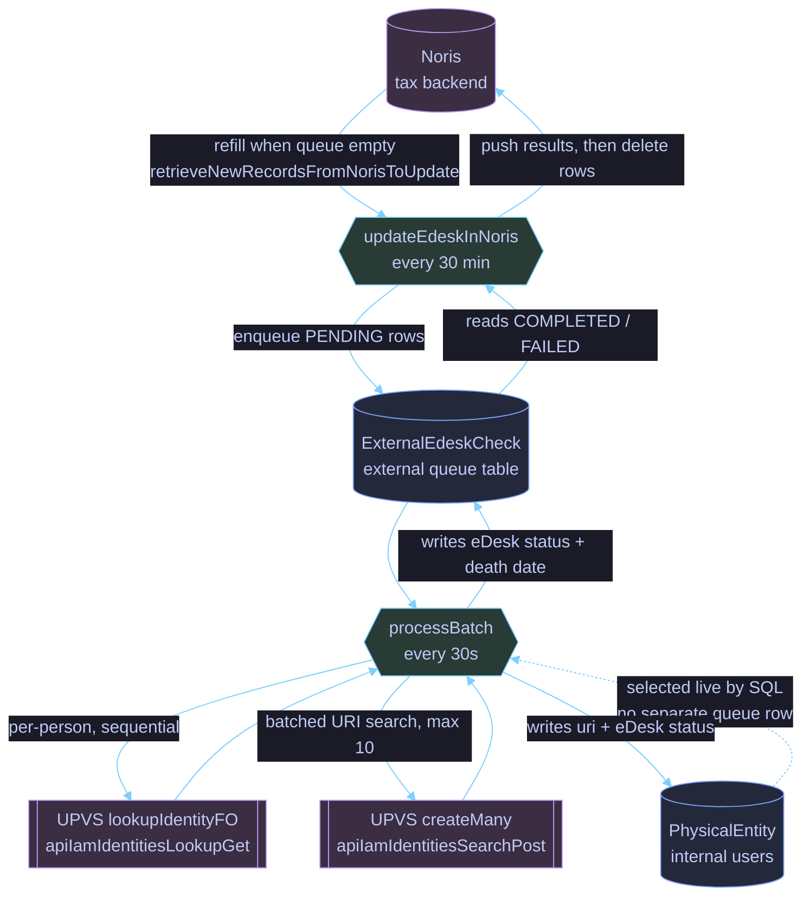
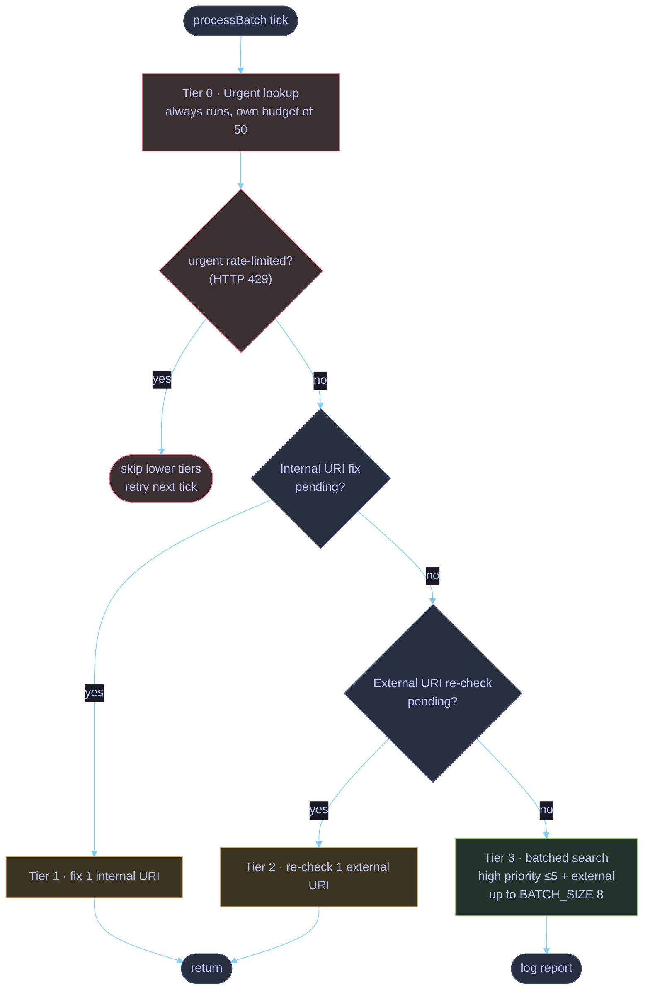
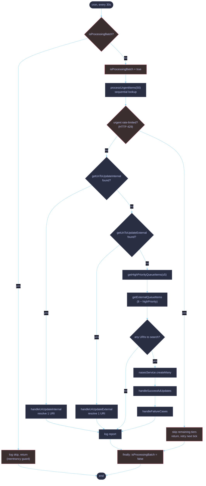
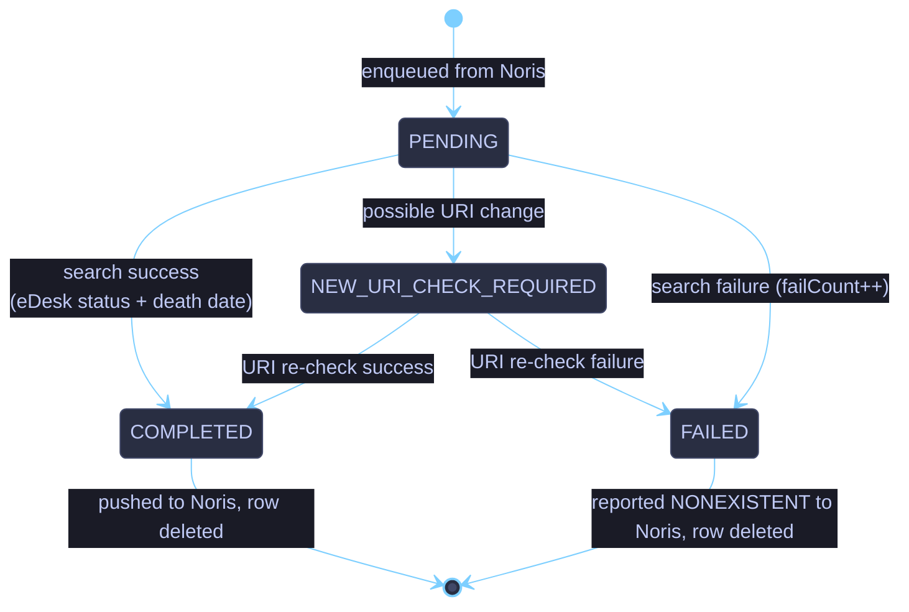
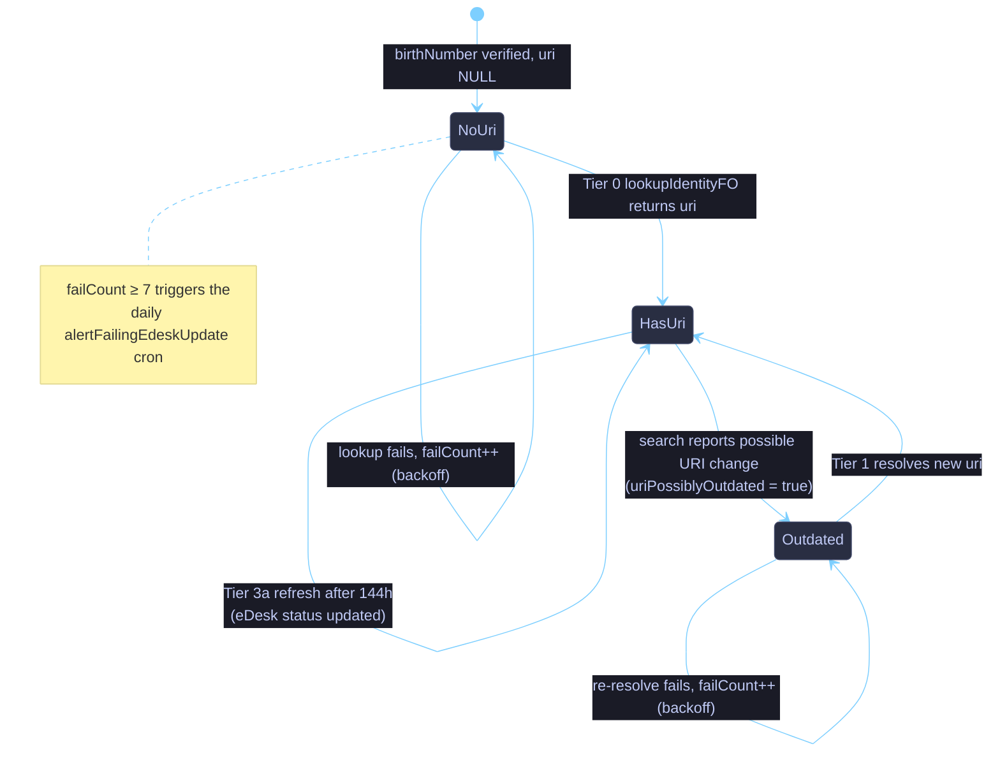

# UPVS multi-tier priority work scheduler

`UpvsQueueService` resolves and refreshes **UPVS identities** (URI + eDesk status) for two
populations:

- **Internal** users - `PhysicalEntity` rows linked to a `User`.
- **External** records - `ExternalEdeskCheck` rows fed from the **Noris** tax backend.

There is no single FIFO queue. Instead, every 30 seconds `processBatch()` selects work from
several **prioritised tiers**, each backed by a different selector and a different UPVS endpoint,
under a shared per-tick budget. This document describes those tiers, the item lifecycles, and the
control flow.

## Cron entry points

| Cadence      | Method                                                                         | Functionality                                                                                                               |
|:-------------|--------------------------------------------------------------------------------|-----------------------------------------------------------------------------------------------------------------------------|
| every 30s    | `TasksService.updateEdesk` -> `UpvsQueueService.processBatch`                  | Pulls one batch of work across all tiers (the scheduler described here).                                                    |
| every 30 min | `TasksService.updateEdeskInNoris` -> `EdeskTasksSubservice.updateEdeskInNoris` | Pushes `COMPLETED`/`FAILED` external results back to Noris, deletes them, refills the external queue from Noris when empty. |
| daily 09:01  | `TasksService.alertFailingEdeskUpdate`                                         | Alerts on `PhysicalEntity` rows that failed ≥ 7 times in a row.                                                             |

## The tiers

Tiers are listed by precedence. **Urgent runs on every tick** with its own budget. After it, the
two single-item _URI-update_ tiers **short-circuit the batch** (they handle one item and return),
so the _search_ tier only runs on ticks where no URI update is pending.

| #  | Tier                      | Selector                                                                             | Items / tick                             | UPVS endpoint                   | Notes                                                      |
|----|---------------------------|--------------------------------------------------------------------------------------|------------------------------------------|---------------------------------|------------------------------------------------------------|
| 0  | **Urgent**                | `PhysicalEntity` with `birthNumber` set and `uri IS NULL` (join `User`)              | `URGENT_BATCH_SIZE = 50`, **sequential** | `lookupIdentityFO` (per person) | Runs first, always. Own budget. Stops the run on HTTP 429. |
| 1  | **Internal URI fix**      | `PhysicalEntity` with `uriPossiblyOutdated = true` (past backoff)                    | 1, then early return                     | `createMany([1])`               | Re-resolves a possibly-changed URI.                        |
| 2  | **External URI re-check** | `ExternalEdeskCheck` with `NEW_URI_CHECK_REQUIRED`                                   | 1, then early return                     | `createMany([1])`               | Re-resolves a possibly-changed external URI.               |
| 3a | **High priority**         | `PhysicalEntity` with `uri` set, cache stale (`CACHE_TTL_HOURS = 144`), past backoff | ≤ `HIGH_PRIORITY_RESERVED_SLOTS = 5`     | `createMany` (batched search)   | Periodic eDesk-status refresh.                             |
| 3b | **External**              | `ExternalEdeskCheck` with `PENDING` and `uri` set                                    | remainder of `BATCH_SIZE = 8`            | `createMany` (batched search)   | Shares the search batch with 3a.                           |

> Tiers 3a + 3b together form a single batched call of ≤ `BATCH_SIZE` (8) URIs, which is within the
> UPVS search limit of 10. The **urgent** budget is fully independent of `BATCH_SIZE`.

## System data flow

## Priority hierarchy (one tick)

## `processBatch` control flow

## `processUrgentItems` - sequential lookup with rate-limit handling

Urgent items use the per-person lookup endpoint. They are processed **one at a time** (not in
parallel), so the load on the endpoint is steady. An HTTP 429 from the endpoint stops the whole
run; the remaining entities are retried next tick.

## External item lifecycle (`ExternalEdeskCheck`)

`queueStatus` drives an external record from enqueue to Noris sync-back and deletion.

## Internal entity eDesk lifecycle (`PhysicalEntity`)

## Tunables

| Constant                       | Value | Meaning                                                                   |
|--------------------------------|-------|---------------------------------------------------------------------------|
| `URGENT_BATCH_SIZE`            | 50    | Max urgent (per-person lookup) entities per tick, processed sequentially. |
| `BATCH_SIZE`                   | 8     | Size of the batched URI-search call (high priority + external).           |
| `HIGH_PRIORITY_RESERVED_SLOTS` | 5     | Max high-priority entities within `BATCH_SIZE`.                           |
| `CACHE_TTL_HOURS`              | 144   | How stale a high-priority entity's eDesk status may be before refresh.    |

## Backoff & resilience

- **Exponential backoff**: failed internal lookups bump `activeEdeskUpdateFailCount`; the selectors
  exclude an entity until `activeEdeskUpdateFailedAt + 2^min(failCount, 7) hours` has passed.
- **Reentrancy guard**: `isProcessingBatch` prevents a slow tick (urgent can take a while) from
  overlapping the next 30s cron fire.
- **Rate-limit cutout**: an HTTP 429 from the lookup endpoint is re-raised with its status kept
  (`fromAxiosError` status override), logged with an alert, and stops the urgent run for that
  tick. The caller also skips the remaining tiers for that tick so we don't keep hitting an
  endpoint that's already throttling us.
- **Isolation**: per-entity failures are recorded and aggregated into a single error log line; one
  bad entity never blocks the rest of the batch.
