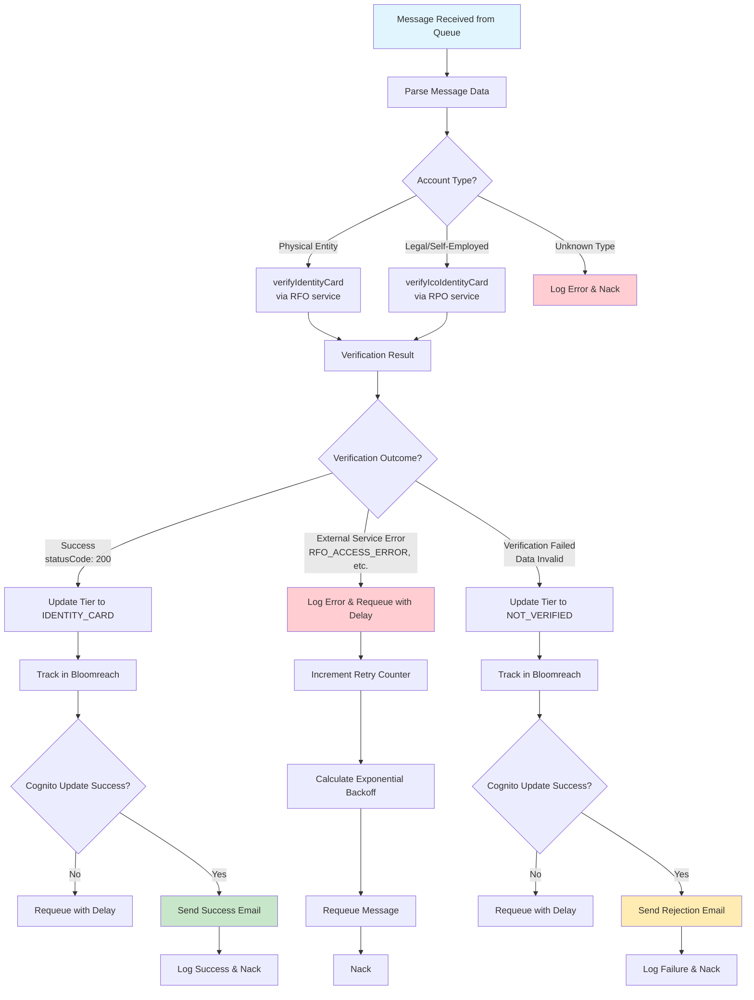
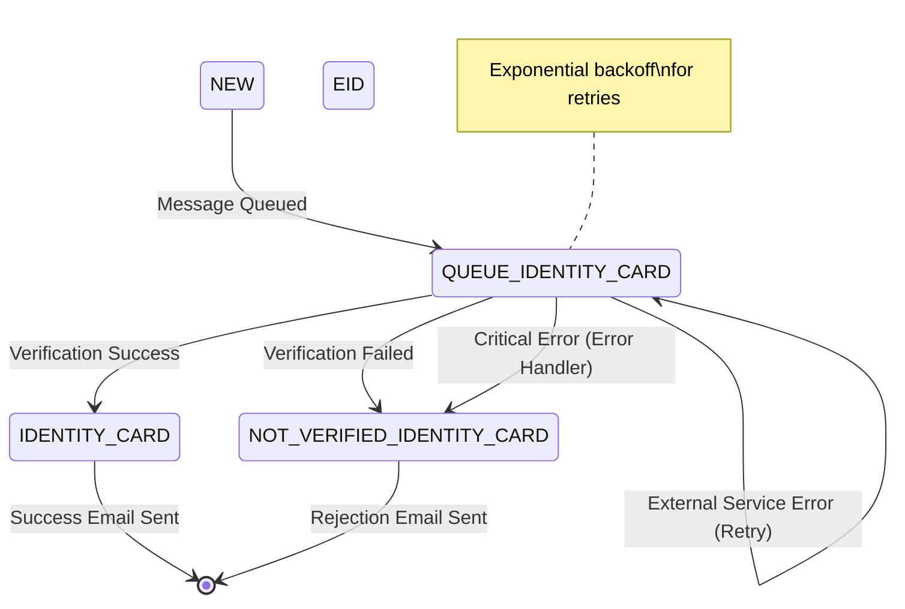

## Process Flow Diagram

```mermaid
flowchart TD
    A[Message Received from Queue] --> B[Parse Message Data]
    B --> C{Account Type?}
    
    C -->|Physical Entity| D[verifyIdentityCard<br/>via RFO service]
    C -->|Legal/Self-Employed| E[verifyIcoIdentityCard<br/>via RPO service]
    C -->|Unknown Type| F[Log Error & Nack]
    
    D --> G[Verification Result]
    E --> G
    
    G --> H{Verification Outcome?}
    
    H -->|Success<br/>statusCode: 200| I[Update Tier to IDENTITY_CARD]
    H -->|External Service Error<br/>RFO_ACCESS_ERROR, etc.| J[Log Error & Requeue with Delay]
    H -->|Verification Failed<br/>Data Invalid| K[Update Tier to NOT_VERIFIED]
    
    I --> L[Track in Bloomreach]
    L --> M{Cognito Update Success?}
    M -->|No| N[Requeue with Delay]
    M -->|Yes| O[Send Success Email]
    O --> P[Log Success & Nack]
    
    J --> Q[Increment Retry Counter]
    Q --> R[Calculate Exponential Backoff]
    R --> S[Requeue Message]
    S --> T[Nack]
    
    K --> U[Track in Bloomreach]
    U --> V{Cognito Update Success?}
    V -->|No| W[Requeue with Delay]
    V -->|Yes| X[Send Rejection Email]
    X --> Y[Log Failure & Nack]
    
    style A fill:#e1f5fe
    style O fill:#c8e6c9
    style X fill:#ffecb3
    style J fill:#ffcdd2
    style F fill:#ffcdd2
```

## Verification Outcome States

```mermaid
stateDiagram-v2
    N: NEW
    Q: QUEUE_IDENTITY_CARD
    NV: NOT_VERIFIED_IDENTITY_CARD
    IC: IDENTITY_CARD
    EID: EID
    N --> Q: Message Queued
    
    Q --> IC: Verification Success
    Q --> NV: Verification Failed
    Q --> Q: External Service Error (Retry)
    Q --> NV: Critical Error (Error Handler)

    note left of Q: Exponential backoff\nfor retries

    IC --> [*]: Success Email Sent
    NV --> [*]: Rejection Email Sent
```
