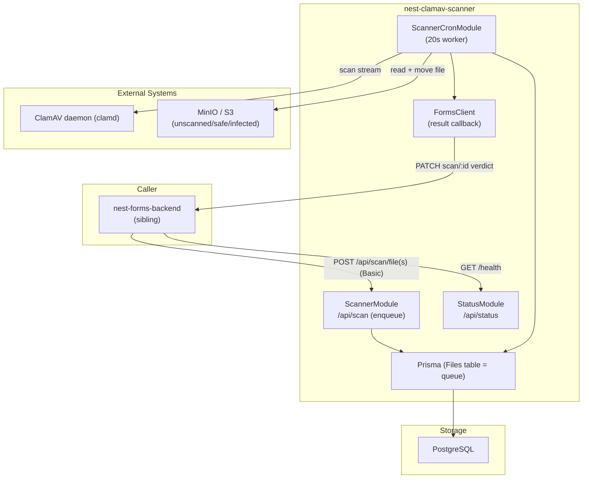
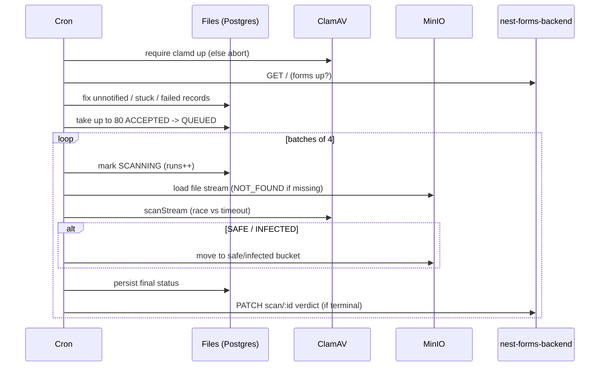

# nest-clamav-scanner -- Architecture

> This is the high-level architecture for the **nest-clamav-scanner** service, one app in the `konto.bratislava.sk` monorepo. For workflows that span multiple konto backends, see the repo-root [`docs/ARCHITECTURE.md`](../../docs/ARCHITECTURE.md).

## System Overview

`nest-clamav-scanner` scans files uploaded to MinIO/S3 for viruses via **ClamAV**. Callers (in practice **nest-forms-backend**) register already-uploaded files for scanning; a 20-second cron worker drains a DB-backed queue, streams each file to ClamAV, moves it to a safe/infected bucket, and calls back to the forms backend with the final verdict.

The backend is a **NestJS** application backed by **PostgreSQL** (Prisma). There is **no message broker** -- the "queue" is a Postgres `Files` table polled by an in-process cron. Callers authenticate with **HTTP Basic auth**.

### Environments

| Environment | URL |
|---|---|
| Production | `https://nest-clamav-scanner.bratislava.sk/` |
| Staging | `https://nest-clamav-scanner.staging.bratislava.sk/` |
| Development | `https://nest-clamav-scanner.dev.bratislava.sk/` |
| Local | `http://localhost:3200/` |

Config is fail-fast validated (`src/config/environment-variables.ts`, `BaConfig`, `BaConfigService`). Key groups: `clamav` (host/port), `minio` (buckets `unscanned`/`safe`/`infected`), `formsBackend` (`NEST_FORMS_BACKEND`), `fileLimits`.

---

## High-Level Architecture

---

## Module Map

Root `src/app.module.ts` wires config, clients, Prisma, MinIO/ClamAV clients, auth, and `ScheduleModule.forRoot()`.

| Module | Route prefix | Auth | Purpose |
|---|---|---|---|
| **AppController** | `/` | public | `GET /health`, `GET /` hello |
| **StatusModule** | `/api/status` | public | Health of prisma / minio / forms / clamav + clamav version |
| **ScannerModule** | `/api/scan` | Basic | Enqueue / query / delete file scan records |
| **ScannerCronModule** | -- | -- | The 20s cron worker doing actual scanning |
| **ClamavClientModule** | -- | -- | `clamdjs` scan client |
| **MinioClient/Storage** | -- | -- | MinIO client + stream/move/list ops |
| **ClientsModule / FormsClientModule** | -- | -- | Builds the `openapi-clients/forms` client; notifies forms of results |

**Scanner endpoints** (`src/scanner/scanner.controller.ts`, all `BasicGuard`): `POST /api/scan/files` (batch, 202), `POST /api/scan/file` (single, 202), `GET /api/scan/file/:fileUid64/:bucketUid64`, `GET /api/scan/file/:resourceId`, `DELETE /api/scan/file/:resourceId`.

---

## Data Model Overview

Single model **`Files`** (`prisma/schema.prisma`): `id` (UUID), `fileUid`, `bucketUid`, `fileSize`, `fileMimeType`, `status` (`FileStatus`, default `ACCEPTED`), `notified` (was forms told), `runs` (scan attempts), `meta` (JSON), timestamps.

`FileStatus` enum: `ACCEPTED`, `QUEUED`, `SCANNING`, `SAFE`, `INFECTED`, `NOT_FOUND`, `MOVE_ERROR_SAFE`, `MOVE_ERROR_INFECTED`, `SCAN_ERROR`, `SCAN_TIMEOUT`, `SCAN_NOT_SUCCESSFUL`, `FORM_ID_NOT_FOUND`. The table doubles as the durable work queue.

---

## Authentication & Authorization

- **HTTP Basic** only -- `BasicStrategy` (`passport-http`, strategy `'auth-basic'`), `BasicGuard` on every `/api/scan/*` endpoint. Credentials `NEST_CLAMAV_SCANNER_USERNAME`/`_PASSWORD` compared with a timing-safe check. No Cognito here.
- **Public** -- `GET /`, `GET /health`, and all `GET /api/status/*` (the forms backend polls `/health`).

---

## External Integrations

- **ClamAV daemon (clamd)** -- `ClamavClientService` via `clamdjs` (`scanStream`, `ping`, `version`); result mapped `OK`->`SAFE`, `FOUND`->`INFECTED`, `SCAN TIMEOUT`->`SCAN_TIMEOUT`. Env `CLAMAV_HOST`/`CLAMAV_PORT`. The clamd daemon + a CVD virus-definition mirror live in the sibling repo dirs `/clamav` and `/cvdmirror`.
- **MinIO / S3** -- `MinioStorageService` (stat/get/copy+remove/list) across three buckets (`unscanned` source, `safe`, `infected`). This is the same S3 where forms-backend uploads files.
- **nest-forms-backend** (sibling) -- bidirectional; see Cross-Backend Calls.

---

## Cross-Backend Calls

Coupled **exclusively** to **nest-forms-backend** (bidirectional, two transports). No city-account or tax-backend interaction.

- **forms -> scanner (inbound):** forms enqueues files (`POST /api/scan/file(s)`), polls status (`GET /api/scan/file/:id`), deletes records (`DELETE`), and polls `GET /health`. Transport: raw axios + Basic auth (forms side: `src/scanner-client/scanner-client.service.ts`).
- **scanner -> forms (outbound callback):** the cron worker pushes the final verdict via `FormsClientService.updateFileStatus` -> `filesControllerUpdateFileStatusScannerId` (`PATCH scan/:scannerId` on forms), using the shared `openapi-clients/forms` client + Basic auth. It callbacks only for terminal statuses (`SAFE`, `INFECTED`, `NOT_FOUND`, `MOVE_ERROR_*`, `SCAN_NOT_SUCCESSFUL`). A `GET /` health poll gates the callback. `fixUnnotifiedFiles()` re-sends any terminal record with `notified=false` each cron tick.

---

## Request / Scan Lifecycle

No global pipes/filters/interceptors; guards are the only per-route gate; validation is manual in `ScannerService`.

**Enqueue** (`ScannerService.scanFile`): validate `fileUid` -> default bucket to `unscanned` -> dedupe (existing -> `410`) -> `fileExists` in MinIO (`404`) -> size check (`413`) -> mime-type vs whitelist (`400`) -> insert `Files` row (`ACCEPTED`) -> `202`. Batch caps at `MAX_FILES_PER_REQUEST`.

**Scan** (`ScannerCronService`, every 20s, single-flight via `globalThis.cronRunning`):

---

## Scheduled Jobs

The scan worker is a single in-process `@Cron('*/20 * * * * *')` job; the durable queue is the Postgres `Files` table (no message broker). Horizontally scaling the worker would double-process without external coordination.

## API Documentation

Swagger UI is served at `/api` (raw OpenAPI spec at `/spec-json`).

## Deployment

The app is containerised and deployed to **Kubernetes** across three environments -- **development**, **staging**, and **production** -- automated through **GitHub Actions**. Infrastructure code lives in [bratislava/infrastructure-deployment-configuration](https://github.com/bratislava/infrastructure-deployment-configuration).

---

> **Keep this doc in sync:** if a code change updates something described here (endpoints, statuses, the scan/callback flow, ClamAV/MinIO wiring, deployment), update this `ARCHITECTURE.md` in the same change.
