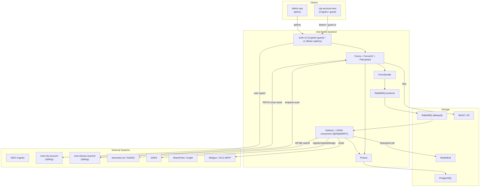
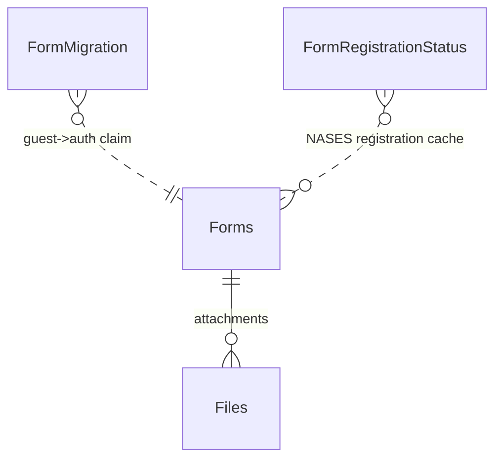
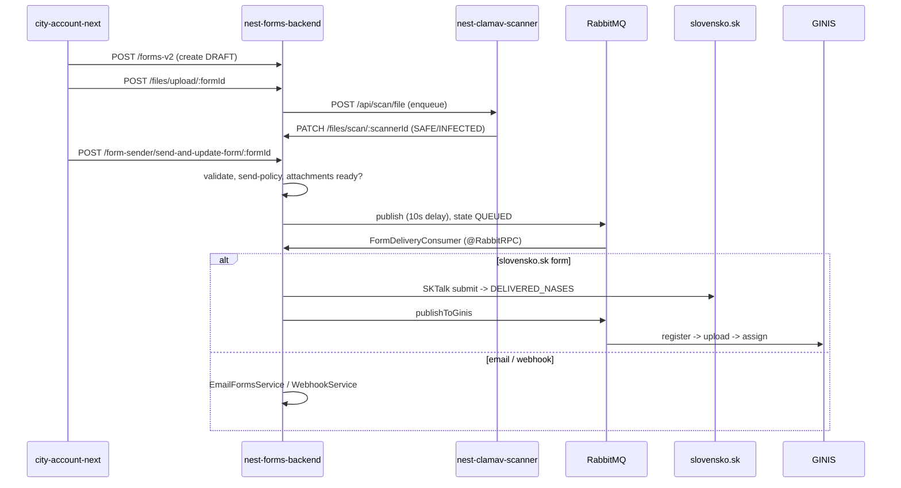

# nest-forms-backend -- Architecture

> This is the high-level architecture for the **nest-forms-backend** service, one app in the `konto.bratislava.sk` monorepo. For workflows that span multiple konto backends, see the repo-root [`docs/ARCHITECTURE.md`](../../docs/ARCHITECTURE.md).

## System Overview

`nest-forms-backend` processes Bratislava City Account **e-forms**. It owns the full form lifecycle: creation, draft editing, file upload + antivirus scanning, validation, submission to the Slovak government (**NASES / slovensko.sk**), registration into **GINIS** (the municipality's registry system), delivery to SharePoint/PowerApps and email/webhook channels, and PDF generation.

The backend is a **NestJS** application backed by **PostgreSQL** (Prisma), with **RabbitMQ** (delayed-message exchange) for async delivery, **Redis/Bull** for SharePoint jobs, **MinIO/S3** for files, and **Playwright/Piscina** for PDF rendering. End users authenticate with **AWS Cognito** (including guest identities); service callers use HTTP Basic / admin apiKey.

Form lifecycle (`FormState`): `DRAFT -> QUEUED -> DELIVERED_NASES -> DELIVERED_GINIS -> SENDING_TO_SHAREPOINT -> PROCESSING -> FINISHED` (plus `REJECTED`, `ERROR`), with a parallel `GinisState` sub-lifecycle.

### Environments

| Environment | URL |
|---|---|
| Production | `https://nest-forms-backend.bratislava.sk/` |
| Staging | `https://nest-forms-backend.staging.bratislava.sk/` |
| Development | `https://nest-forms-backend.dev.bratislava.sk/` |
| Local | `http://localhost:3100/` |

Config is validated/typed (`src/config/environment-variables.ts`, `BaConfigService`). `CLUSTER_ENV` is `dev`/`staging`/`production`.

---

## High-Level Architecture

---

## Module Map

Root `src/app.module.ts` imports ~20 feature modules plus `AppSharedModule` (Bull/Redis, Schedule, MinIO, Prisma) and `AppV2Module`.

| Module | Prefix | Auth | Purpose |
|---|---|---|---|
| **FormsModule** | `forms` | v2 | Form CRUD (get/list/update/archive/bump-version) |
| **FormsV2Module** | `forms-v2`, `forms/migrations` | v2 | Form creation + guest->auth migration |
| **FilesModule** | `files` | v2 / Basic | Upload, JWT-signed download, **scanner status callback** |
| **FormSenderModule** | `form-sender` | v2 | Submit form (standard + eID) |
| **NasesModule** | -- | -- | slovensko.sk submission + identity + registration cron |
| **GinisModule** | `ginis` | -- | GINIS register/upload/assign + SharePoint + state cron; RabbitRPC consumer |
| **FormDeliveryConsumerModule** | -- | -- | Consumes form-delivery queue; routes to email/webhook/slovensko.sk |
| **ConvertModule / ConvertPdfModule** | `convert` | -- | JSON<->XML, JSON->PDF (Playwright) |
| **TaxModule** | -- | -- | Tax-form PDF via Piscina worker (in-process, no tax-backend call) |
| **SignerModule** | `signer` | -- | Prepare data for eID signer software |
| **AdminModule** | `admin` | apiKey | Mint JWTs, trigger NASES registration check |
| **AuthModule / AuthV2Module** | -- | -- | v1 (Basic + apiKey) / v2 (Cognito + guest + city-account user) |
| **ClientsModule / ScannerClientModule** | -- | -- | `openapi-clients` (city-account, slovensko-sk) + ClamAV axios client |
| **MailerModule / WebhookModule / StatusModule** | `webhook`, `status` | mixed | Mailgun + OLO SMTP; inbound webhook (logs); health |

---

## Data Model Overview

### Models (`prisma/schema.prisma`)

- **Forms** -- main aggregate. Ownership (`userExternalId` = Cognito sub, `cognitoGuestIdentityId` for guests, `email`, `ownerType` FO/PO, `ico`), NASES fields (`mainUri`, `senderId`, `formSentAt`), content (`formDefinitionSlug`, `jsonVersion`, `formDataJson`, `formSignature`, `formSummary`), `state` (`FormState`), `error` (`FormError`), GINIS (`ginisDocumentId`, `ginisState`).
- **Files** -- `formId`, `scannerId` (unique, from ClamAV), `minioFileName`, `status` (`FileStatus`), GINIS upload tracking.
- **FormMigration** -- guest->authenticated claim (`cognitoAuthSub`, `cognitoGuestIdentityId`, `expiresAt`).
- **FormRegistrationStatus** -- NASES registration cache keyed `[slug, pospId, pospVersion]`.

`FileStatus` mirrors the scanner's statuses (UPLOADED, SAFE, INFECTED, ...). `FormError` enumerates delivery failures (scan/NASES/GINIS/SharePoint/email/webhook).

---

## Authentication & Authorization

Two generations coexist:

- **v2 (end users)** -- `UserAuthStrategy` (`passport-custom`) accepts **either** a Cognito Bearer token **or** a guest-identity header (never both). Bearer path verifies the JWT (`aws-jwt-verify`), fetches Cognito attributes, and fetches the City Account user (cross-backend, see below). Guest path assumes the unauth IAM role via STS and validates the ARN. `UserAuthGuard` + `@AllowedUserTypes(...)` gate user types; `FormAccessGuard` enforces per-form ownership.
- **v1 (service/admin)** -- `BasicStrategy` (HTTP Basic, `NEST_FORMS_BACKEND_USERNAME/PASSWORD`, timing-safe) -- **used by the ClamAV scanner callback**; `AdminStrategy` (`apiKey` -> `ADMIN_APP_SECRET`) on `admin` endpoints.

**Public**: root, status, `POST /webhook`, and `GET /files/download/file/:jwtToken` (auth inside a signed JWT). Auth schemes: Bearer, Basic, apiKey, and a custom `cognitoGuestIdentityId` header.

---

## External Integrations

| Integration | Purpose | Files / env |
|---|---|---|
| **nest-city-account** (sibling) | Resolve/create the City Account user on every authenticated request. | `src/clients/clients.service.ts`, `src/auth-v2/services/city-account-user.service.ts`; `USER_ACCOUNT_API`. See Cross-Backend. |
| **nest-clamav-scanner** (sibling) | Antivirus scanning of uploaded files (bidirectional). | `src/scanner-client/scanner-client.service.ts`, `src/files/*`; `NEST_CLAMAV_SCANNER`. See Cross-Backend. |
| **slovensko.sk / NASES** | Government form submission (SKTalk XML) + identity. | `src/nases/*`, `openapi-clients/slovensko-sk`, `src/api-jwt-tokens/*`; `SLOVENSKO_SK_*`. |
| **GINIS** | The municipality's registry system: register/upload/assign documents (`@bratislava/ginis-sdk`). | `src/ginis/*`; `GINIS_*`. |
| **SharePoint / Graph** | Deliver "nájomné bývanie" forms after NASES (Bull job). | `src/ginis/subservices/sharepoint.service.ts`; `SHAREPOINT_*`. |
| **MinIO / S3** | File storage (unscanned/safe/infected buckets). | `src/minio-*`; `MINIO_*`. |
| **Mailgun / OLO SMTP** | Confirmation + delivery emails. | `src/mailer/*`; `MAILGUN_*`, `OLO_SMTP_*`. |
| **forms-shared** (local dep) | Form definitions, validation, summary, send-policy, signature, tax-PDF, SharePoint mapping. | bundled `forms-shared` package. |

Note: form definitions come from the **bundled `forms-shared` package** (compile-time), not a live Strapi call. Tax PDFs are generated **in-process** (Piscina) -- there is no call to nest-tax-backend.

---

## Cross-Backend Calls

Within konto, forms-backend talks to **nest-city-account** and **nest-clamav-scanner** (not tax-backend).

- **-> nest-city-account** (per authenticated request): `UserAuthStrategy` -> `CityAccountUserService.getUser` -> `userControllerUpsertUser` (forwards the user Bearer) to resolve/create the City Account user. Transport: HTTPS via `openapi-clients/city-account`.
- **-> nest-clamav-scanner** (on file upload): `FilesHelper.notifyScannerClient` -> `POST /api/scan/file` (+ poll/delete + `GET /health`). Transport: axios + HTTP Basic.
- **<- nest-clamav-scanner** (scan-result callback): the scanner cron calls `PATCH /files/scan/:scannerId` (`BasicGuard`) -> `FilesService.updateFileStatusScannerId` updates the `Files` row and moves the object between MinIO buckets.

See the repo-root [`docs/ARCHITECTURE.md`](../../docs/ARCHITECTURE.md) for these as end-to-end workflows.

---

## Request Lifecycle

Global setup (`src/bootstrap.ts`): CORS, 50 MB JSON body, global `ValidationPipe`, global filters `ErrorFilter` -> `HttpExceptionFilter`, `AppLoggerMiddleware` on `*`. Per-route guards (`UserAuthGuard`, `FormAccessGuard`, `FormDefinitionMustBeEnabledGuard`) and interceptors (`FileUploadInterceptor`, multer + mimetype whitelist).

Representative flow -- **submit a form with attachments**:

The **eID** path (`/form-sender/eid/...`) verifies the signature, submits to NASES synchronously, then queues GINIS.

---

> **Keep this doc in sync:** if a code change updates something described here (modules, data model, auth, integrations, cross-backend calls, delivery pipeline), update this `ARCHITECTURE.md` in the same change.
