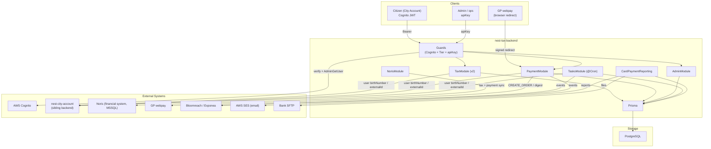
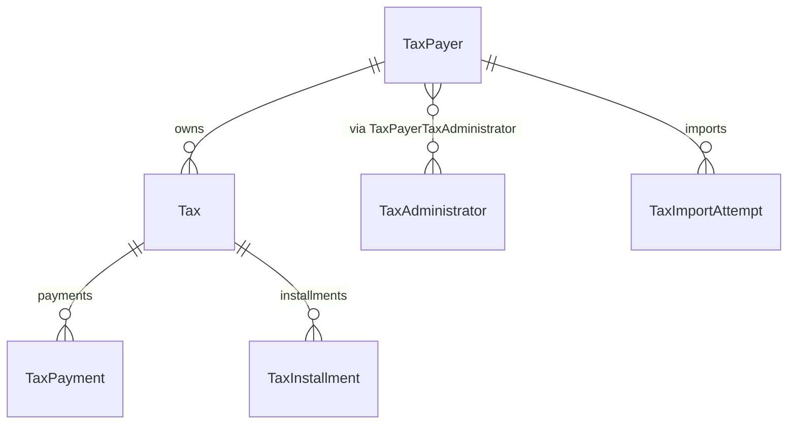
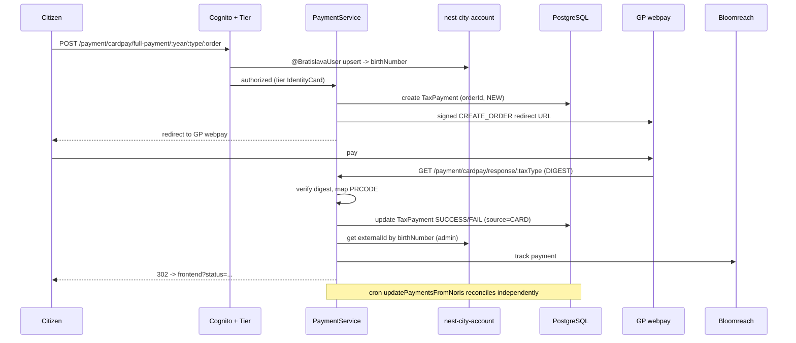

# nest-tax-backend -- Architecture

> This is the high-level architecture for the **nest-tax-backend** service, one app in the `konto.bratislava.sk` monorepo. For workflows that span multiple konto backends, see the repo-root [`docs/ARCHITECTURE.md`](../../docs/ARCHITECTURE.md).

## System Overview

`nest-tax-backend` is the backend for the City of Bratislava's **digital tax payment** in City Account (konto.bratislava.sk). It ingests taxes and payments from the municipal **Noris** financial system, presents tax detail to citizens, generates card-payment links (GP webpay) and QR pay-by-square codes, reconciles payments, and produces bank reports.

It handles two tax types (`TaxType`): **DZN** (daň z nehnuteľnosti / real-estate tax) and **KO** (komunálny odpad / municipal waste tax). Users authenticate with **AWS Cognito**; user identity (birth number) is resolved through the sibling **nest-city-account** service.

The backend is a **NestJS** application backed by **PostgreSQL** (Prisma), plus an integration to the external **Noris** financial system (an **MSSQL** database). All async work is `@nestjs/schedule` `@Cron` jobs (no queue/broker).

### Environments

| Environment | URL |
|---|---|
| Production | `https://nest-tax-backend.bratislava.sk/` |
| Staging | `https://nest-tax-backend.staging.bratislava.sk/` |
| Development | `https://nest-tax-backend.dev.bratislava.sk/` |
| Local | `http://localhost:3000/` |

Config is validated/typed via decorator classes (`src/config/environment-variables.ts`, `ba-config.ts`, `BaConfigService`). `CLUSTER_ENV` is `dev`/`staging`/`production`. Some runtime config lives in a DB `Config` table (reporting params, Noris error counters).

---

## High-Level Architecture

---

## Module Map

Root `src/app.module.ts` wires config, Cognito, Prisma, the feature modules, and `ScheduleModule.forRoot()`; `AppLoggerMiddleware` runs on all routes; `AppController` exposes `GET /healthcheck`.

| Module | Prefix / version | Auth | Purpose |
|---|---|---|---|
| **Tax** (`src/tax/`) | `tax` (v2) | Cognito + Tier | Read tax detail & tax lists for the citizen |
| **Payment** (`src/payment/`) | `payment` | Cognito + Tier (response public) | GP webpay link creation + gateway response processing |
| **Admin** (`src/admin/`) | `admin` | apiKey | Load/update taxes & payments from Noris; testing taxes (non-prod) |
| **Noris** (`src/noris/`) | -- | -- | Integration with the Noris financial system, MSSQL (tax + payment sync) |
| **Tasks** (`src/tasks/`) | -- | -- | All `@Cron` jobs (Noris sync, city-account ingestion, reminders, reporting) |
| **CardPaymentReporting** | `card-payment-reporting` | apiKey | Generate + email/SFTP card-payment bank reports |
| **Bloomreach**, **QrCode**, **Clients**, **Prisma**, **Shared**, **Config** | -- | -- | CRM events, QR codes, sibling HTTP client, DB, cross-cutting helpers, typed env |

Citizen endpoints require Cognito tier `IdentityCard` (`TiersGuard` + `@Tiers`). `@BratislavaUser()` (`UserInfoPipe`) upserts the caller in city-account and yields their `birthNumber`.

---

## Data Model Overview

### Models (`prisma/schema.prisma`)

- **TaxPayer** -- citizen; `birthNumber` (unique), `externalId`, address, per-tax-type sync watermarks (`lastUpdatedAtDZN`, `lastUpdatedAtKO`).
- **Tax** -- one tax per `[taxPayerId, year, type, order]`; `amount` (cents), `variableSymbol` (unique payment key), `taxDetails` (JSON), delivery method, cancellation and reminder flags. `order` set by a DB trigger.
- **TaxPayment** -- `orderId` (unique GP webpay order = timestamp), `status` (`NEW`/`FAIL`/`SUCCESS`), `amount`, `source` (`CARD`/`QRCODE`/`BANK_ACCOUNT`/`POST`/`CASH`).
- **TaxInstallment** -- installment schedule with due dates + reminder tracking.
- **TaxAdministrator** / **TaxPayerTaxAdministrator** -- tax officials (M:N by tax type).
- **CsvFile**, **Config**, **TaxImportAttempt** -- reporting file tracking, DB-driven config, Noris import status.

Enums: `TaxType`, `PaymentStatus`, `TaxPaymentSource`, `DeliveryMethodNamed`, `UnpaidReminderSent`, `TaxImportStatus`. Amounts are integer cents throughout.

---

## Authentication & Authorization

- **Cognito (citizen)** -- `CognitoAuthModule` verifies access tokens; `AuthenticationGuard` on citizen routes. `TiersGuard` (`@Tiers`) reads the user's `custom:tier` from Cognito (`AdminGetUserCommand`) and requires `IdentityCard` for tax/payment endpoints.
- **Admin apiKey** -- `AdminStrategy` (Passport `HeaderAPIKeyStrategy`, header `apiKey`) compared to `ADMIN_APP_SECRET` with a timing-safe check; `AdminGuard` on all `/admin/*` and `/card-payment-reporting/*` endpoints.
- **NotProductionGuard** -- blocks test-only endpoints in production.
- **Public** -- `GET /healthcheck` and `GET /payment/cardpay/response/:taxType` (GP webpay redirect; integrity enforced by digest verification, not a guard).

---

## External Integrations

| Integration | Purpose | Files / env |
|---|---|---|
| **Noris** (financial system, MSSQL) | Source of truth for taxes & payments; read via `mssql`. | `src/noris/subservices/*`; `MSSQL_*` |
| **nest-city-account** (sibling) | Resolve user birth number / `externalId`; ingest new verified users. | `src/clients/clients.service.ts`, `src/utils/subservices/cityaccount.subservice.ts`; `CITY_ACCOUNT_API_URL`, `CITY_ACCOUNT_ADMIN_API_KEY` -- see Cross-Backend. |
| **GP webpay** | Card payment link (SHA1-signed CREATE_ORDER) + response digest verification. | `src/payment/subservices/gpwebpay.subservice.ts`; `PAYGATE_*` (per-tax-type keys). |
| **pay-by-square / QR** | QR pay codes (`bysquare` + `qrcode`). | `src/qrcode/qrcode.service.ts`. |
| **Bloomreach / Exponea** | CRM events (tax created, payment, unpaid reminders), keyed by `city_account_id`. | `src/bloomreach/bloomreach.service.ts`; `BLOOMREACH_*`. |
| **AWS SES** | Card-payment report email (SES over Mailgun for GDPR). | `src/utils/subservices/email.subservice.ts`; `AWS_SES_*`. |
| **Bank SFTP** | Upload/read report files. | `src/utils/subservices/sftp-file.subservice.ts`; `REPORTING_*`. |
| **AWS Cognito** | JWT verify + `AdminGetUser` for tier. | `src/utils/subservices/cognito.subservice.ts`. |

Mailgun env vars exist in `.env.example` but are unused (mail goes via SES); there is no GINIS integration.

---

## Cross-Backend Calls

The only konto sibling involved is **nest-city-account** (over HTTP via the shared `openapi-clients/city-account`). There are **no** calls to/from nest-forms-backend or nest-clamav-scanner. Outbound to city-account:

1. **Upsert current user** -- on every guarded citizen request (`@BratislavaUser()` -> `userControllerUpsertUser`, forwards the user bearer) to resolve `birthNumber`.
2. **Get user data by birth number** (admin apiKey) -- during payment-success processing to fetch `externalId` for Bloomreach.
3. **Batch user data by birth numbers** (admin) -- during Noris import, payment/overpayment processing, and reminder crons.
4. **New verified users** (admin, cron `EVERY_30_SECONDS`) -- `loadNewUsersFromCityAccount` creates `TaxPayer` rows for newly verified City Account users (watermark in the `Config` table).

No inbound sibling-called endpoints (the only inbound HTTP is the external GP webpay redirect).

---

## Request Lifecycle

Global pipeline (`src/main.ts`): URI versioning -> CORS -> global `ValidationPipe` -> global filters `ErrorFilter` -> `TypeErrorFilter` -> `HttpExceptionFilter`. `AppLoggerMiddleware` logs method/URL/status/timing (and decodes the JWT `sub`). `ThrowerErrorGuard` is the standard exception factory; `@HandleErrors` wraps cron methods.

Representative flow -- **full card payment**:

---

## Scheduled Jobs

All async work is `@nestjs/schedule` `@Cron` jobs (`src/tasks/tasks.service.ts`) -- Noris tax/payment sync, unpaid reminders, card-payment reporting, city-account ingestion (every 30s), historical/overpayment loads, Bloomreach resend, and Noris-connection-error alerts. There is no message broker.

## API Documentation

Swagger UI is served at `/api` (raw OpenAPI spec at `/spec-json`).

## Deployment

The app is containerised and deployed to **Kubernetes** across three environments -- **development**, **staging**, and **production** -- automated through **GitHub Actions**. Infrastructure code lives in [bratislava/infrastructure-deployment-configuration](https://github.com/bratislava/infrastructure-deployment-configuration).

---

> **Keep this doc in sync:** if a code change updates something described here (modules, data model, auth, integrations, cross-backend calls, crons, deployment), update this `ARCHITECTURE.md` in the same change.
