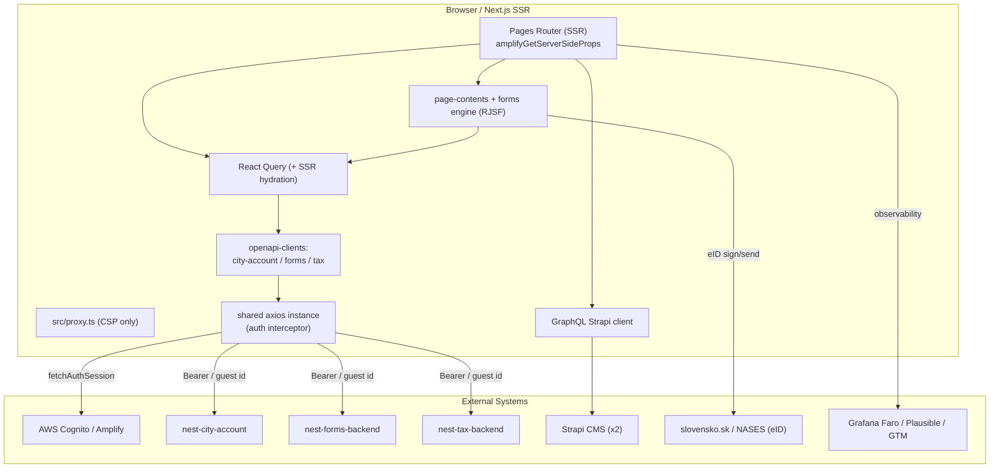
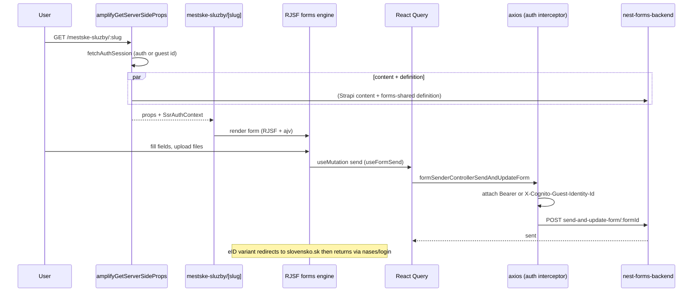

# city-account-next (Frontend) -- Architecture

> This is the high-level architecture for the **next** web frontend (`city-account-next`), one app in the `konto.bratislava.sk` monorepo. For workflows that span multiple konto backends, see the repo-root [`docs/ARCHITECTURE.md`](../../docs/ARCHITECTURE.md).

## System Overview

`city-account-next` is the **City Account (Bratislavské konto)** web frontend: account management, the e-forms UI, and the tax UI. It has no business data of its own -- it consumes three sibling konto backends (**nest-city-account**, **nest-forms-backend**, **nest-tax-backend**) through generated typed clients, plus two **Strapi** CMS instances for content, and authenticates users with **AWS Cognito** (via Amplify, including guest identities).

It is a **Next.js** (Pages Router, Turbopack) application built to a `standalone` server, with heavy SSR via `getServerSideProps` wrapped in Amplify server context, and **TanStack React Query** for client/SSR data. Slovak is the only shipped locale.

### Environments

`.env.example` is empty; the authoritative env contract is `src/environment.ts` (validated, `assertEnv` throws on missing). Public vars are `NEXT_PUBLIC_*` baked at build time (per-environment images via bratiska-cli `.env.bratiska-cli-build.{dev,staging,prod}`).

| Var | Points at |
|---|---|
| `NEXT_PUBLIC_CITY_ACCOUNT_URL` | nest-city-account |
| `NEXT_PUBLIC_FORMS_URL` | nest-forms-backend |
| `NEXT_PUBLIC_TAXES_URL` | nest-tax-backend |
| `NEXT_PUBLIC_SLOVENSKO_SK_LOGIN_URL` | slovensko.sk / NASES eID login |
| `bratislavaStrapiUrl`, `cityAccountStrapiUrl` | two Strapi CMS instances |

Plus Cognito (user/identity pool, cookie domain, region), Cloudflare Turnstile, Grafana Faro, GTM, feature toggles.

---

## High-Level Architecture

---

## Routing / Page Map

Next.js **Pages Router** (`src/pages/`, Slovak slugs; centralized in `src/utils/routes.tsx`). There is **no `middleware.ts`**: Next 16's `src/proxy.ts` handles **Content-Security-Policy only**; auth gating is per-page via `amplifyGetServerSideProps` options.

| Area | Routes |
|---|---|
| Home / help | `index.tsx`, `pomoc.tsx` |
| Auth | `prihlasenie` (login), `registracia`, `zabudnute-heslo`, `zmena-hesla`, `zmena-emailu`, `odhlasenie`, `overenie-identity` |
| OAuth / SSO / eID | `oauth`, `oauth-potvrdenie`, `sso`, `get-jwt`, `nases/login` (eID token return) |
| Account | `moj-profil` |
| Forms | `mestske-sluzby` (list), `mestske-sluzby/[slug]` (create), `mestske-sluzby/[slug]/[id]`, `moje-ziadosti` + `[ziadost]` |
| Tax | `dane-a-poplatky`, `dane-a-poplatky/[year]/[type]/[order]`, `.../platba` |
| Payment | `platba/stav` (result) |
| API routes | `api/csp-report`, `api/healthcheck`, `api/robots` |

`_app.tsx` sets up the provider stack; `_document.tsx` injects the CSP nonce.

---

## Directory Map

| Directory | Purpose |
|---|---|
| `src/pages/` | Routes + API routes. |
| `src/components/` | `auth-forms/`, `forms/` (RJSF e-form engine), `fields/`, `page-contents/` (per-route content), `layouts/`, `segments/` (NavBar/Footer/…), `simple-components/`, styleguide. |
| `src/frontend/` | App logic: `hooks/` (`useSsrAuth`, `useUser`, OAuth/redirect/form hooks), `utils/` (Amplify wrappers, logger/Faro, ginis, metadata storage), `dtos/`. |
| `src/clients/` | `axios-instance.ts` + thin wrappers `city-account.ts`, `forms.ts`, `tax.ts`, and `graphql-strapi/` (generated GraphQL SDK). |
| `src/backend/` | SSR-only helpers (Strapi tax-administrator, GINIS DTO). |
| `src/utils/` | UI utils (`routes.tsx`, `cn.ts`, sizing hooks). |
| `public/locales/sk/` | `account.json`, `forms.json`, `rjsf-errors.json`. |

Path alias `@/*` -> repo root. Shared packages `forms-shared` and `openapi-clients` are local `file:` deps (transpiled at build).

---

## Data Layer & State

- **React Query (`@tanstack/react-query` v5)** -- `QueryClient` created in `_app.tsx`; SSR pages create their own client, prefetch, `dehydrate`, and pass `dehydratedState` into a `HydrationBoundary`.
- **Generated clients** -- `openapi-clients` (local `file:` dep) is wrapped per backend in `src/clients/{city-account,forms,tax}.ts`, each bound to the correct base URL and the shared axios instance. See **Generated API Client**.
- **Shared axios + auth interceptor** (`src/clients/axios-instance.ts`) -- augments requests with an `authStrategy` (`authOnly` / `authOrGuestWithToken` / `authOrGuestNoToken` / `noAuth`). The request interceptor attaches auth: browser -> Amplify `fetchAuthSession()`, server -> caller-supplied `getSsrAuthSession()`. Signed-in -> `Authorization: Bearer`; guest -> `X-Cognito-Guest-Identity-Id`.
- **Strapi** -- a `graphql-request` client (`src/clients/graphql-strapi/`) with a `graphql-codegen`-generated SDK; queries in `queries/*.graphql` drive landing pages, homepage, help, tax config content.
- **forms-shared** -- shared form definitions, validation, send-policy, and summary logic used by the forms engine.

---

## Authentication & Authorization

**AWS Cognito via Amplify** (`src/frontend/utils/amplifyConfig.ts`) -- User Pool + Client + **Identity Pool** with `allowGuestAccess: true`, SSR mode (`ssr: true`).

- **`amplifyGetServerSideProps`** (`src/frontend/utils/amplifyServer.ts`) is the central SSR auth wrapper: always calls `fetchAuthSession` (so guests get an identityId), computes `isSignedIn`, fetches user attributes, injects `SsrAuthContext` (consumed by `useSsrAuth`), and enforces route protection via `requiresSignIn` / `requiresSignOut` / OAuth-redirect options.
- **Token storage** -- Amplify manages tokens in cookies scoped to `cognitoCookieStorageDomain`; tokens reach backends only through the axios interceptor.
- **Login** (`prihlasenie.tsx`) uses `aws-amplify/auth` and, on success, upserts the user via `cityAccountClient.userControllerUpsertUser`.
- **eID / NASES** -- `nases/login.tsx` receives the slovensko.sk token; identity-verification forms drive Cognito tier upgrades.

---

## External Integrations

| Integration | Purpose |
|---|---|
| **nest-city-account** (`city-account.ts`) | Users, GDPR consents, OAuth client recording. |
| **nest-forms-backend** (`forms.ts`) | Form CRUD/send, file upload + scanning, GINIS document detail. |
| **nest-tax-backend** (`tax.ts`) | Tax lists/details/payment. |
| **Strapi CMS (x2)** | GraphQL content: landing pages, homepage, help, tax admin/config. |
| **AWS Cognito** | Auth + guest identities. |
| **slovensko.sk / NASES** | eID form signing/sending + identity verification. |
| **GINIS** | Application ("žiadosť") detail (via the forms client). |
| **Observability / analytics** | Grafana Faro (prod), Plausible (proxied), GTM + Clarity/GA + Cookiebot consent. |
| **Cloudflare Turnstile** | Captcha on auth/forms. |
| **Iframe embedding** | `@iframe-resizer/*` + custom adapter (OLO reuses forms in an iframe). |

---

## Data Lifecycle -- Filling & submitting an e-form

The tax flow is analogous: `dane-a-poplatky` SSR calls `taxClient.taxControllerV2GetTaxesListV2` (`authOnly`) for DZN + KO, dehydrates React Query state, and renders under tax data/config providers; payment continues at `.../platba` with the result at `platba/stav`.

---

## Localization

- `next-i18next.config.js` -- `defaultLocale: 'sk'`, `locales: ['sk']` (Slovak only). `appWithTranslation` in `_app.tsx`; SSR translations via `slovakServerSideTranslations`.
- Namespaces `account`, `forms`, `rjsf-errors` in `public/locales/sk/`. Extraction via `i18next-cli` (`parse-translations`). React-Aria `I18nProvider locale="sk-SK"`.

---

## Generated API Client

The three backend clients come from the local **`openapi-clients`** package (regenerated from each backend's OpenAPI spec). `src/clients/{city-account,forms,tax}.ts` instantiate them against `environment.*Url` and the shared axios instance. When a backend's endpoints change, regenerate `openapi-clients` rather than editing generated code.

---

## Deployment

The app is containerised (standalone Next.js build) and deployed to **Kubernetes** across three environments -- **development**, **staging**, and **production** -- automated through **GitHub Actions**. Infrastructure code lives in [bratislava/infrastructure-deployment-configuration](https://github.com/bratislava/infrastructure-deployment-configuration).

---

> **Keep this doc in sync:** if a code change updates something described here (routing, auth, data layer, integrations, deployment), update this `ARCHITECTURE.md` in the same change.
